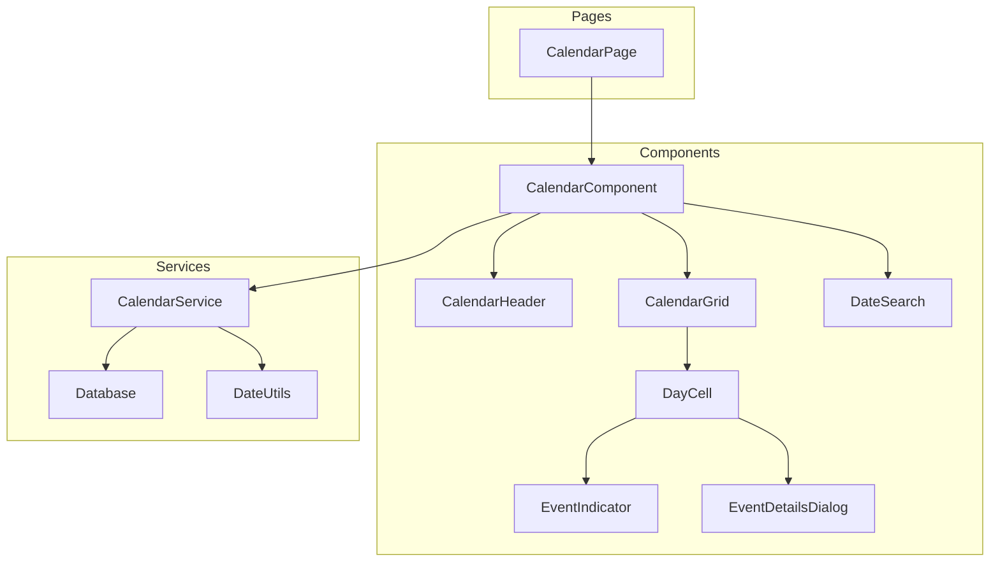

# Design Document: Calendar View

## Overview

לוח שנה אינטראקטיבי למערכת ניהול הגמ"ח המציג תאריכים לועזיים ועבריים יחד עם אירועים פיננסיים. הלוח בנוי כרכיב React מותאם (ללא ספרייה חיצונית) בסגנון Material Design, תומך RTL, ומשתלב עם מערכת הנתונים הקיימת.

## Architecture



## Components and Interfaces

### CalendarPage (src/pages/Calendar.tsx)

דף ראשי המכיל את רכיב הלוח ומנהל את ה-state הגלובלי.

```typescript
interface CalendarPageState {
  currentDate: Date           // התאריך הנוכחי לתצוגה
  selectedDate: Date | null   // יום נבחר לתצוגת פרטים
  events: CalendarEvent[]     // אירועים לחודש הנוכחי
  loading: boolean
  error: string | null
}
```

### CalendarComponent (src/components/calendar/CalendarComponent.tsx)

רכיב הלוח הראשי המרכז את כל תת-הרכיבים.

```typescript
interface CalendarComponentProps {
  currentDate: Date
  events: CalendarEvent[]
  onDateChange: (date: Date) => void
  onDayClick: (date: Date) => void
  onSearch: (searchTerm: string) => void
}
```

### CalendarHeader (src/components/calendar/CalendarHeader.tsx)

כותרת הלוח עם ניווט וחיפוש.

```typescript
interface CalendarHeaderProps {
  currentDate: Date
  onPrevMonth: () => void
  onNextMonth: () => void
  onToday: () => void
  onSearch: (searchTerm: string) => void
}
```

### CalendarGrid (src/components/calendar/CalendarGrid.tsx)

רשת הימים של החודש.

```typescript
interface CalendarGridProps {
  currentDate: Date
  events: CalendarEvent[]
  onDayClick: (date: Date) => void
  selectedDate: Date | null
}
```

### DayCell (src/components/calendar/DayCell.tsx)

תא יום בודד עם תאריכים ואירועים.

```typescript
interface DayCellProps {
  date: Date
  isCurrentMonth: boolean
  isToday: boolean
  isSelected: boolean
  hebrewDate: string
  events: CalendarEvent[]
  onClick: () => void
}
```

### EventIndicator (src/components/calendar/EventIndicator.tsx)

סימון צבעוני לאירוע.

```typescript
interface EventIndicatorProps {
  type: EventType
  count?: number  // מספר אירועים מאותו סוג
}

type EventType = 
  | 'loan_due'        // 🔴 פירעון הלוואה
  | 'recurring_deposit' // 🟢 הפקדה מחזורית
  | 'planned_loan'    // 🔵 הלוואה מתוכננת
  | 'deposit_due'     // 🟠 הפקדה להחזרה
  | 'regular_loan'    // 🟣 הלוואה רגילה
```

### EventDetailsDialog (src/components/calendar/EventDetailsDialog.tsx)

דיאלוג פרטי אירועים.

```typescript
interface EventDetailsDialogProps {
  open: boolean
  date: Date
  events: CalendarEvent[]
  onClose: () => void
}
```

### DateSearch (src/components/calendar/DateSearch.tsx)

רכיב חיפוש תאריך.

```typescript
interface DateSearchProps {
  onSearch: (date: Date) => void
  onError: (message: string) => void
}
```

## Data Models

### CalendarEvent

```typescript
interface CalendarEvent {
  id: string
  type: EventType
  date: string              // YYYY-MM-DD
  title: string
  description: string
  amount: number
  relatedId: number         // loan_id / deposit_id
  relatedName: string       // borrower_name / depositor_name
  metadata?: {
    remaining?: number      // יתרה להלוואה
    loanType?: string
    depositPeriod?: string
  }
}
```

### CalendarService (src/services/calendarService.ts)

```typescript
interface CalendarService {
  // טעינת אירועים לחודש
  getEventsForMonth(year: number, month: number): Promise<CalendarEvent[]>
  
  // טעינת אירועים ליום ספציפי
  getEventsForDay(date: Date): Promise<CalendarEvent[]>
  
  // המרת תאריך עברי ללועזי
  parseHebrewDate(hebrewDate: string): Date | null
  
  // בדיקת תקינות תאריך
  parseSearchDate(input: string): Date | null
}
```

## Event Color Mapping

| Event Type | Color | MUI Color | Hex |
|------------|-------|-----------|-----|
| loan_due (פירעון) | 🔴 | error.main | #d32f2f |
| recurring_deposit (הפקדה מחזורית) | 🟢 | success.main | #2e7d32 |
| planned_loan (הלוואה מתוכננת) | 🔵 | info.main | #0288d1 |
| deposit_due (הפקדה להחזרה) | 🟠 | warning.main | #ed6c02 |
| regular_loan (הלוואה רגילה) | 🟣 | secondary.main | #9c27b0 |


## Component Layout

### Calendar Page Layout

```
┌─────────────────────────────────────────────────────────────┐
│  CalendarHeader                                              │
│  ┌─────────────────────────────────────────────────────────┐│
│  │ [<] [היום] [>]    ינואר 2026 / טבת-שבט תשפ"ו    [🔍]   ││
│  └─────────────────────────────────────────────────────────┘│
├─────────────────────────────────────────────────────────────┤
│  CalendarGrid                                                │
│  ┌────┬────┬────┬────┬────┬────┬────┐                       │
│  │ ש  │ ו  │ ה  │ ד  │ ג  │ ב  │ א  │  (Day Headers)       │
│  ├────┼────┼────┼────┼────┼────┼────┤                       │
│  │    │    │ 1  │ 2  │ 3  │ 4  │ 5  │                       │
│  │    │    │ א' │ ב' │ ג' │ ד' │ ה' │                       │
│  │    │    │🔴🟢│    │🔵  │    │    │                       │
│  ├────┼────┼────┼────┼────┼────┼────┤                       │
│  │ 6  │ 7  │ 8  │ 9  │ 10 │ 11 │ 12 │                       │
│  │ ו' │ ז' │ ח' │ ט' │ י' │י"א │י"ב │                       │
│  │    │🟠  │    │🟣  │    │🔴  │    │                       │
│  └────┴────┴────┴────┴────┴────┴────┘                       │
│                                                              │
│  Legend (מקרא):                                              │
│  🔴 פירעון  🟢 הפקדה מחזורית  🔵 הלוואה מתוכננת             │
│  🟠 הפקדה להחזרה  🟣 הלוואה רגילה                           │
└─────────────────────────────────────────────────────────────┘
```

### DayCell Layout

```
┌──────────────┐
│  15    ט"ו   │  <- Gregorian + Hebrew date
│              │
│   🔴 🟢 🔵   │  <- Event indicators (max 3 visible)
│     +2       │  <- More indicator if > 3 events
└──────────────┘
```

### EventDetailsDialog Layout

```
┌─────────────────────────────────────────┐
│  אירועים ליום 15/01/2026 (ט"ו שבט)  [X] │
├─────────────────────────────────────────┤
│  🔴 פירעון הלוואה                        │
│     ישראל ישראלי                         │
│     סכום: ₪5,000 | יתרה: ₪15,000        │
├─────────────────────────────────────────┤
│  🟢 הפקדה מחזורית                        │
│     משה כהן                              │
│     סכום: ₪10,000                        │
├─────────────────────────────────────────┤
│  🔵 הלוואה מתוכננת                       │
│     דוד לוי                              │
│     סכום: ₪20,000                        │
└─────────────────────────────────────────┘
```

## Algorithm: Event Loading

```typescript
async function getEventsForMonth(year: number, month: number): Promise<CalendarEvent[]> {
  const events: CalendarEvent[] = []
  const startDate = new Date(year, month, 1)
  const endDate = new Date(year, month + 1, 0)
  
  // 1. Load loan due dates (פירעונות)
  const loans = await loansService.getAll()
  for (const loan of loans) {
    if (loan.status === 'active' && loan.due_date) {
      const dueDate = new Date(loan.due_date)
      if (isInRange(dueDate, startDate, endDate)) {
        events.push({
          id: `loan_due_${loan.id}`,
          type: 'loan_due',
          date: loan.due_date,
          title: 'פירעון הלוואה',
          description: `הלוואה של ${loan.borrower_name}`,
          amount: loan.remaining || loan.amount,
          relatedId: loan.id,
          relatedName: loan.borrower_name || '',
          metadata: { remaining: loan.remaining }
        })
      }
    }
  }
  
  // 2. Load regular loan dates (הלוואות רגילות)
  for (const loan of loans) {
    const loanDate = new Date(loan.loan_date)
    if (isInRange(loanDate, startDate, endDate)) {
      events.push({
        id: `regular_loan_${loan.id}`,
        type: loan.status === 'planned' ? 'planned_loan' : 'regular_loan',
        date: loan.loan_date,
        title: loan.status === 'planned' ? 'הלוואה מתוכננת' : 'הלוואה',
        description: `הלוואה ל${loan.borrower_name}`,
        amount: loan.amount,
        relatedId: loan.id,
        relatedName: loan.borrower_name || ''
      })
    }
  }
  
  // 3. Load recurring deposits (הפקדות מחזוריות)
  const deposits = await db.query('SELECT * FROM deposits')
  for (const deposit of deposits) {
    if (deposit.is_recurring && deposit.status === 'active') {
      const recurringDay = deposit.recurring_day || new Date(deposit.deposit_date).getDate()
      const eventDate = new Date(year, month, Math.min(recurringDay, endDate.getDate()))
      events.push({
        id: `recurring_deposit_${deposit.id}_${month}`,
        type: 'recurring_deposit',
        date: eventDate.toISOString().split('T')[0],
        title: 'הפקדה מחזורית',
        description: `הפקדה של ${deposit.depositor_name}`,
        amount: deposit.amount,
        relatedId: deposit.id,
        relatedName: deposit.depositor_name || ''
      })
    }
  }
  
  // 4. Load deposit due dates (הפקדות להחזרה)
  for (const deposit of deposits) {
    if (deposit.due_date && deposit.status === 'active') {
      const dueDate = new Date(deposit.due_date)
      if (isInRange(dueDate, startDate, endDate)) {
        events.push({
          id: `deposit_due_${deposit.id}`,
          type: 'deposit_due',
          date: deposit.due_date,
          title: 'הפקדה להחזרה',
          description: `הפקדה של ${deposit.depositor_name}`,
          amount: deposit.amount,
          relatedId: deposit.id,
          relatedName: deposit.depositor_name || ''
        })
      }
    }
  }
  
  return events
}
```

## Algorithm: Hebrew Date Parsing

```typescript
function parseHebrewDate(input: string): Date | null {
  // Pattern: ט"ו שבט תשפ"ו or טו שבט תשפו
  const hebrewMonths = {
    'תשרי': 0, 'חשון': 1, 'כסלו': 2, 'טבת': 3,
    'שבט': 4, 'אדר': 5, 'אדר א': 5, 'אדר ב': 6,
    'ניסן': 6, 'אייר': 7, 'סיון': 8, 'תמוז': 9,
    'אב': 10, 'אלול': 11
  }
  
  // Use @hebcal/core for accurate conversion
  try {
    const parts = input.trim().split(' ')
    if (parts.length >= 3) {
      const day = gematriyaToNumber(parts[0])
      const month = hebrewMonths[parts[1]]
      const year = gematriyaToNumber(parts[2])
      
      const hdate = new HDate(day, month + 1, year)
      return hdate.greg()
    }
  } catch (e) {
    return null
  }
  return null
}
```


## Correctness Properties

*A property is a characteristic or behavior that should hold true across all valid executions of a system—essentially, a formal statement about what the system should do. Properties serve as the bridge between human-readable specifications and machine-verifiable correctness guarantees.*

### Property 1: Calendar Grid Days Count

*For any* year and month combination, the calendar grid SHALL contain exactly the correct number of days for that month (28-31 days depending on month and leap year).

**Validates: Requirements 1.1**

### Property 2: Event-to-Indicator Mapping

*For any* event loaded from the database, the corresponding Day_Cell SHALL display an Event_Indicator with the correct color based on event type:
- loan_due → red (#d32f2f)
- recurring_deposit → green (#2e7d32)
- planned_loan → blue (#0288d1)
- deposit_due → orange (#ed6c02)
- regular_loan → purple (#9c27b0)

**Validates: Requirements 2.1, 2.2, 2.3, 2.4, 2.5, 2.6**

### Property 3: Event Data Loading Completeness

*For any* month displayed, the Calendar_Component SHALL load and display events for:
- All active loans with due_date in that month
- All recurring deposits scheduled for that month
- All planned loans with loan_date in that month
- All deposits with due_date in that month
- All regular loans with loan_date in that month

**Validates: Requirements 6.2, 6.3, 6.4, 6.5**

### Property 4: Month Navigation Consistency

*For any* current month M, clicking the previous month button SHALL display month M-1, and clicking the next month button SHALL display month M+1, with all events correctly loaded for the new month.

**Validates: Requirements 4.2, 4.3, 4.5**

### Property 5: Event Details Display Completeness

*For any* event displayed in the Event_Details_Dialog, the dialog SHALL show:
- Event type indicator
- Amount in ₪
- Related person name (borrower/depositor)
- For loan events: remaining balance
- For deposit events: deposit period

**Validates: Requirements 3.1, 3.2, 3.3, 3.4**

### Property 6: Hebrew Date Conversion Round-Trip

*For any* valid Gregorian date D, converting D to Hebrew date H and then converting H back to Gregorian SHALL produce the original date D.

**Validates: Requirements 8.3**

### Property 7: Date Search Parsing

*For any* valid date string in supported formats (DD/MM/YYYY, DD.MM.YYYY, Hebrew date), the Date_Search component SHALL correctly parse and navigate to the corresponding date.

**Validates: Requirements 8.2, 8.5**

## Error Handling

### Data Loading Errors

```typescript
try {
  const events = await calendarService.getEventsForMonth(year, month)
  setEvents(events)
} catch (error) {
  setError('שגיאה בטעינת אירועים. נסה לרענן את הדף.')
  console.error('Calendar data loading error:', error)
}
```

### Date Parsing Errors

```typescript
function handleSearch(input: string): void {
  const date = calendarService.parseSearchDate(input)
  if (!date) {
    setSearchError('תאריך לא תקין. נסה פורמט DD/MM/YYYY או תאריך עברי')
    return
  }
  navigateToDate(date)
}
```

### Edge Cases

1. **Empty month**: חודש ללא אירועים - הצגת הודעה "אין אירועים בחודש זה"
2. **Invalid Hebrew date**: תאריך עברי לא תקין - הצגת שגיאה
3. **Future dates**: תאריכים עתידיים רחוקים - תמיכה מלאה
4. **Leap years**: שנים מעוברות - חישוב נכון של ימים בפברואר ואדר

## Testing Strategy

### Unit Tests

Unit tests will verify specific examples and edge cases:

1. **Calendar grid rendering**: Verify correct number of days for specific months
2. **Event indicator colors**: Verify correct color for each event type
3. **Date parsing**: Verify parsing of specific date formats
4. **Hebrew date conversion**: Verify conversion of specific dates

### Property-Based Tests

Property-based tests will use **vitest** with **fast-check** library to verify universal properties:

```typescript
import { fc } from '@fast-check/vitest'
import { test } from 'vitest'

// Property 1: Calendar Grid Days Count
test.prop([fc.integer({ min: 2000, max: 2100 }), fc.integer({ min: 0, max: 11 })])(
  'calendar grid has correct number of days for any month',
  (year, month) => {
    const daysInMonth = new Date(year, month + 1, 0).getDate()
    const grid = generateCalendarGrid(year, month)
    expect(grid.filter(d => d.isCurrentMonth).length).toBe(daysInMonth)
  }
)

// Property 6: Hebrew Date Round-Trip
test.prop([fc.date({ min: new Date(2000, 0, 1), max: new Date(2100, 11, 31) })])(
  'Hebrew date conversion is reversible',
  (date) => {
    const hebrew = toHebrewDate(date)
    const backToGregorian = parseHebrewDate(hebrew)
    expect(backToGregorian?.toDateString()).toBe(date.toDateString())
  }
)
```

### Test Configuration

- Minimum 100 iterations per property test
- Each property test references its design document property
- Tag format: **Feature: calendar-view, Property {number}: {property_text}**

### Test Files Structure

```
src/__tests__/
  calendar.test.ts           # Unit tests
  calendar.property.test.ts  # Property-based tests
```
