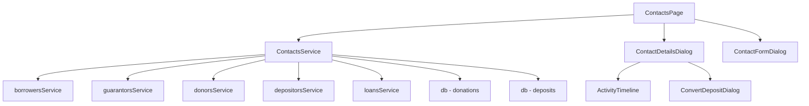
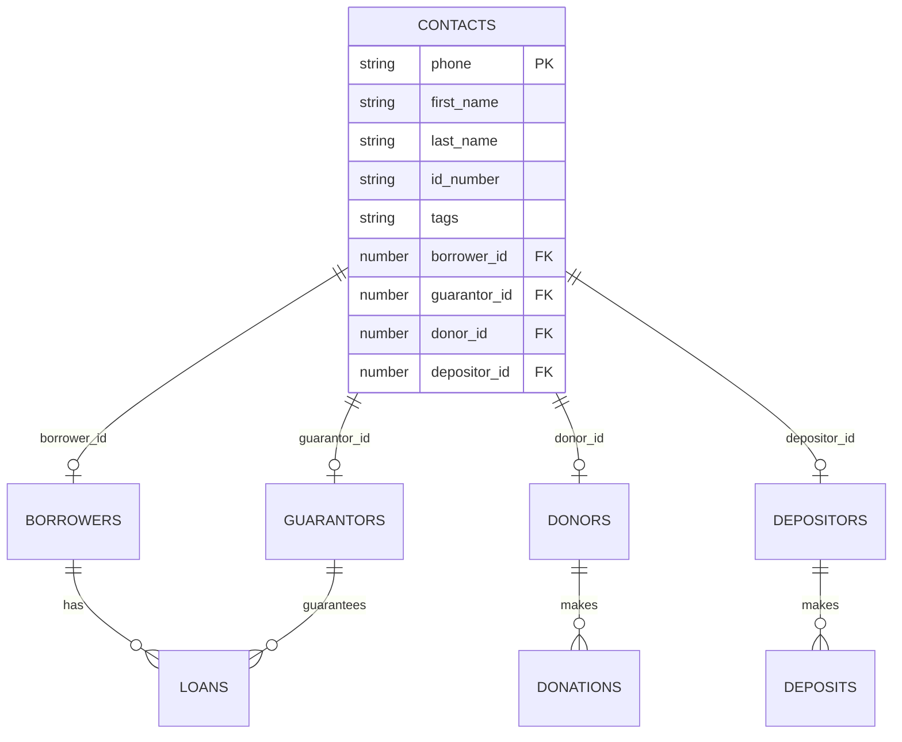

# מסמך עיצוב - אנשי קשר מאוחדים

## סקירה כללית

מאפיין "אנשי קשר מאוחדים" מספק תצוגה מרכזית ומאוחדת של כל האנשים במערכת הגמ"ח. במקום לנהל לווים, ערבים, תורמים ומפקידים בנפרד, המערכת תזהה ותאחד אנשים לפי מספר טלפון ייחודי, ותציג את כל התפקידים והפעילויות שלהם במקום אחד.

העיצוב מבוסס על ארכיטקטורה של שירות אנשי קשר חדש (`contactsService`) שמאחד את הנתונים מכל השירותים הקיימים (borrowers, guarantors, donors, depositors) ומספק API אחיד לעבודה עם אנשי קשר.

## ארכיטקטורה

### רכיבים עיקריים

1. **ContactsService** - שירות מרכזי לניהול אנשי קשר מאוחדים
2. **ContactsPage** - דף ראשי להצגת רשימת אנשי קשר
3. **ContactDetailsDialog** - דיאלוג להצגת פרטים מלאים של איש קשר
4. **ContactFormDialog** - דיאלוג להוספה/עריכה של איש קשר
5. **ActivityTimeline** - רכיב להצגת היסטוריית פעילות
6. **ConvertDepositDialog** - דיאלוג להמרת הפקדה לתרומה

### תרשים ארכיטקטורה



## רכיבים וממשקים

### 1. ContactsService

שירות מרכזי שמאחד נתונים מכל השירותים הקיימים.

#### ממשקי נתונים

```typescript
interface UnifiedContact {
  // מזהה ייחודי (מספר טלפון)
  id: string
  
  // פרטים בסיסיים
  first_name: string
  last_name: string
  phone: string
  id_number?: string
  city?: string
  address?: string
  email?: string
  notes?: string
  
  // תפקידים
  roles: ContactRole[]
  
  // מזהים בטבלאות המקוריות
  borrower_id?: number
  guarantor_id?: number
  donor_id?: number
  depositor_id?: number
  
  // סטטיסטיקות
  stats: ContactStats
  
  // תגיות
  tags: string[]
  
  // תאריכים
  created_at: string
  updated_at: string
}

interface ContactRole {
  type: 'borrower' | 'guarantor' | 'donor' | 'depositor'
  entity_id: number
  active: boolean
}

interface ContactStats {
  // לווה
  total_loans: number
  active_loans: number
  total_borrowed: number
  total_debt: number
  
  // ערב
  total_guarantees: number
  active_guarantees: number
  total_guaranteed: number
  
  // תורם
  total_donations: number
  total_donated: number
  
  // מפקיד
  total_deposits: number
  active_deposits: number
  total_deposited: number
  active_deposit_amount: number
  
  // מאזן נטו
  net_balance: number
}

interface ContactActivity {
  id: string
  type: 'loan' | 'repayment' | 'donation' | 'deposit' | 'withdrawal' | 'guarantee'
  date: string
  amount: number
  status: string
  description: string
  related_entity_id: number
}
```

#### פונקציות עיקריות

```typescript
// קבלת כל אנשי הקשר
async function getAllContacts(): Promise<UnifiedContact[]>

// קבלת איש קשר לפי טלפון
async function getContactByPhone(phone: string): Promise<UnifiedContact | null>

// חיפוש אנשי קשר
async function searchContacts(term: string): Promise<UnifiedContact[]>

// סינון לפי תפקידים
async function filterByRoles(roles: ContactRole['type'][]): Promise<UnifiedContact[]>

// יצירת איש קשר חדש
async function createContact(data: Partial<UnifiedContact>, initialRoles: ContactRole['type'][]): Promise<UnifiedContact>

// עדכון איש קשר
async function updateContact(phone: string, data: Partial<UnifiedContact>): Promise<void>

// מחיקת איש קשר
async function deleteContact(phone: string): Promise<void>

// קבלת היסטוריית פעילות
async function getContactActivity(phone: string): Promise<ContactActivity[]>

// קבלת סטטיסטיקות
async function getContactStats(phone: string): Promise<ContactStats>

// המרת הפקדה לתרומה
async function convertDepositToDonation(depositId: number, contactPhone: string): Promise<void>

// הוספת תגית
async function addTag(phone: string, tag: string): Promise<void>

// הסרת תגית
async function removeTag(phone: string, tag: string): Promise<void>
```

### 2. ContactsPage

דף ראשי להצגת רשימת אנשי קשר עם אפשרויות חיפוש וסינון.

#### מבנה UI

```
┌─────────────────────────────────────────────────────┐
│ אנשי קשר                                            │
├─────────────────────────────────────────────────────┤
│ [חיפוש...]                    [+ איש קשר חדש]      │
│                                                     │
│ סינון לפי תפקיד:                                   │
│ ☐ לווים (45)  ☐ ערבים (32)  ☐ תורמים (28)        │
│ ☐ מפקידים (15)                                     │
├─────────────────────────────────────────────────────┤
│ ┌─────────────────────────────────────────────┐   │
│ │ שם              תפקידים        מאזן  פעולות│   │
│ ├─────────────────────────────────────────────┤   │
│ │ כהן משה        🏦💰          +5,000  [👁][✏]│   │
│ │ לוי דוד        🏦🤝          -2,000  [👁][✏]│   │
│ │ ישראל שרה      💰📥          +8,000  [👁][✏]│   │
│ └─────────────────────────────────────────────┘   │
└─────────────────────────────────────────────────────┘

אייקונים:
🏦 = לווה
🤝 = ערב
💰 = תורם
📥 = מפקיד
```

#### State Management

```typescript
const [contacts, setContacts] = useState<UnifiedContact[]>([])
const [filteredContacts, setFilteredContacts] = useState<UnifiedContact[]>([])
const [searchTerm, setSearchTerm] = useState('')
const [roleFilters, setRoleFilters] = useState<Set<ContactRole['type']>>(new Set())
const [selectedContact, setSelectedContact] = useState<UnifiedContact | null>(null)
const [detailsDialogOpen, setDetailsDialogOpen] = useState(false)
const [formDialogOpen, setFormDialogOpen] = useState(false)
```

### 3. ContactDetailsDialog

דיאלוג מפורט המציג את כל המידע על איש קשר.

#### מבנה UI

```
┌─────────────────────────────────────────────────────┐
│ פרטי איש קשר - כהן משה                      [✕]    │
├─────────────────────────────────────────────────────┤
│ פרטים אישיים:                                       │
│ טלפון: 050-1234567  מ.ז.: 123456789               │
│ עיר: ירושלים  כתובת: רחוב הרצל 10                 │
│ אימייל: moshe@example.com                          │
│                                                     │
│ תפקידים: 🏦 לווה  💰 תורם                         │
│                                                     │
│ סטטיסטיקות:                                        │
│ ┌─────────────┬─────────────┬─────────────┐        │
│ │ הלוואות     │ תרומות      │ מאזן נטו    │        │
│ │ 2 פעילות    │ 5 תרומות    │ +5,000 ₪    │        │
│ │ 15,000 ₪    │ 20,000 ₪    │             │        │
│ └─────────────┴─────────────┴─────────────┘        │
│                                                     │
│ היסטוריית פעילות:                                  │
│ ┌─────────────────────────────────────────────┐   │
│ │ 📅 15/01/2024 - תרומה - 5,000 ₪            │   │
│ │ 📅 10/01/2024 - הלוואה - 10,000 ₪          │   │
│ │ 📅 05/01/2024 - פירעון - 3,000 ₪           │   │
│ └─────────────────────────────────────────────┘   │
│                                                     │
│ פעולות מהירות:                                     │
│ [הלוואה חדשה] [תרומה חדשה] [עריכה]               │
└─────────────────────────────────────────────────────┘
```

### 4. ActivityTimeline

רכיב להצגת היסטוריית פעילות בצורה כרונולוגית.

```typescript
interface ActivityTimelineProps {
  activities: ContactActivity[]
  onActivityClick?: (activity: ContactActivity) => void
}
```

### 5. ConvertDepositDialog

דיאלוג להמרת הפקדה לתרומה.

```typescript
interface ConvertDepositDialogProps {
  open: boolean
  deposit: Deposit
  contact: UnifiedContact
  onClose: () => void
  onConfirm: () => void
}
```

## מודלים של נתונים

### אחסון נתונים

המערכת תשתמש בטבלאות הקיימות ותוסיף טבלת `contacts` חדשה לאחסון מידע מאוחד:

```typescript
interface ContactsTable {
  phone: string // מפתח ראשי
  first_name: string
  last_name: string
  id_number?: string
  city?: string
  address?: string
  email?: string
  notes?: string
  tags: string // JSON array
  borrower_id?: number
  guarantor_id?: number
  donor_id?: number
  depositor_id?: number
  created_at: string
  updated_at: string
}
```

### אסטרטגיית איחוד

1. **זיהוי ראשוני**: מספר טלפון הוא המזהה הייחודי
2. **מיזוג אוטומטי**: כאשר מוסיפים ישות חדשה, המערכת בודקת אם קיים איש קשר עם אותו טלפון
3. **עדכון דו-כיווני**: שינויים באיש קשר מתעדכנים בכל הישויות המקושרות
4. **שמירה על תאימות**: הטבלאות הקיימות נשארות ללא שינוי, רק מתווספת טבלת contacts

### תרשים מודל נתונים



## תכונות נכונות (Correctness Properties)

תכונה (Property) היא מאפיין או התנהגות שצריכה להתקיים בכל ביצועי המערכת - בעצם, הצהרה פורמלית על מה שהמערכת צריכה לעשות. תכונות משמשות כגשר בין מפרטים קריאים לאדם לבין ערבויות נכונות הניתנות לאימות מכני.


### תכונות נכונות

#### תכונה 1: איחוד אנשי קשר ללא כפילויות
*לכל* רשימת אנשי קשר שמוחזרת מהמערכת, כל מספר טלפון צריך להופיע בדיוק פעם אחת, גם אם לאיש הקשר יש מספר תפקידים.
**מאמתת: דרישות 1.4, 4.5**

#### תכונה 2: ייחודיות מספר טלפון
*לכל* ניסיון להוסיף או לעדכן איש קשר, אם מספר הטלפון כבר קיים במערכת (בכל אחת מהטבלאות), המערכת צריכה לדחות את הפעולה או להציע קישור לאיש הקשר הקיים.
**מאמתת: דרישות 2.2, 5.3**

#### תכונה 3: ייחודיות מספר זהות
*לכל* ניסיון להוסיף או לעדכן איש קשר עם מספר זהות, אם מספר הזהות כבר קיים במערכת (בכל אחת מהטבלאות), המערכת צריכה לדחות את הפעולה.
**מאמתת: דרישות 2.3, 5.4**

#### תכונה 4: אימות מספר זהות ישראלי
*לכל* מספר זהות שמוזן למערכת, אם הוא מכיל 9 ספרות, המערכת צריכה לאמת אותו באמצעות אלגוריתם Luhn, ולדחות מספרים לא תקינים.
**מאמתת: דרישה 2.5**

#### תכונה 5: זיהוי תפקידים מלא
*לכל* איש קשר שמוצג, המערכת צריכה להציג את כל התפקידים שיש לו בכל הטבלאות (borrowers, guarantors, donors, depositors).
**מאמתת: דרישה 1.2**

#### תכונה 6: חיפוש חוצה טבלאות
*לכל* מונח חיפוש (שם, טלפון, או מספר זהות), המערכת צריכה להחזיר את כל אנשי הקשר התואמים מכל הטבלאות, ללא כפילויות.
**מאמתת: דרישות 1.3, 10.1-10.4**

#### תכונה 7: מיון אלפביתי
*לכל* רשימת אנשי קשר שמוחזרת, היא צריכה להיות ממוינת לפי שם משפחה ואז שם פרטי בסדר אלפביתי.
**מאמתת: דרישה 1.5**

#### תכונה 8: היסטוריה מלאה
*לכל* איש קשר, המערכת צריכה להציג את כל הפעילויות שלו (הלוואות כלווה, הלוואות כערב, תרומות, הפקדות) בסדר כרונולוגי.
**מאמתת: דרישות 3.1-3.6**

#### תכונה 9: קישור תפקיד חדש
*לכל* איש קשר קיים, כאשר מוסיפים לו תפקיד חדש, המערכת צריכה ליצור רשומה בטבלה המתאימה ולקשר אותה לאיש הקשר, ולעדכן את רשימת התפקידים.
**מאמתת: דרישות 2.4, 4.4**

#### תכונה 10: עדכון דו-כיווני
*לכל* שינוי בפרטי איש קשר (שם, כתובת, אימייל, הערות), המערכת צריכה לעדכן את המידע בכל הטבלאות המקושרות (borrowers, guarantors, donors, depositors).
**מאמתת: דרישה 5.2**

#### תכונה 11: מניעת מחיקה עם פעילות פעילה
*לכל* איש קשר, אם יש לו הלוואות פעילות (כלווה או כערב), הפקדות פעילות, או ערבויות פעילות, המערכת צריכה למנוע את מחיקתו.
**מאמתת: דרישה 5.5**

#### תכונה 12: סינון לפי תפקידים
*לכל* קבוצת תפקידים שנבחרה לסינון, המערכת צריכה להחזיר רק אנשי קשר שיש להם לפחות אחד מהתפקידים הנבחרים.
**מאמתת: דרישות 6.1-6.4**

#### תכונה 13: חישוב סטטיסטיקות נכון
*לכל* איש קשר, הסטטיסטיקות שמוצגות (סך הלוואות, סך תרומות, סך הפקדות, מאזן נטו) צריכות להיות שוות לסכום הפעילויות בפועל מהטבלאות המקוריות.
**מאמתת: דרישות 7.1-7.5**

#### תכונה 14: המרת הפקדה לתרומה
*לכל* הפקדה פעילה שמומרת לתרומה, המערכת צריכה ליצור רשומת תרומה חדשה עם אותו סכום, לסמן את ההפקדה כנמשכה, ולהוסיף הערה לשתי הרשומות.
**מאמתת: דרישות 9.2-9.5**

#### תכונה 15: שמירת הערות ותגיות
*לכל* איש קשר, כאשר מוסיפים הערה או תגית, היא צריכה להישמר ולהיות נגישה בכל הצפיות הבאות של איש הקשר.
**מאמתת: דרישות 12.1-12.2**

#### תכונה 16: ייצוא מלא
*לכל* פעולת ייצוא, הקובץ המיוצא צריך לכלול את כל השדות של כל איש קשר (שם, טלפון, זהות, כתובת, אימייל, תפקידים, סטטיסטיקות) שעומדים בקריטריוני הסינון.
**מאמתת: דרישות 11.3-11.4**

## טיפול בשגיאות

### שגיאות ולידציה

1. **טלפון כפול**: הצגת דיאלוג עם פרטי איש הקשר הקיים ואפשרות לקשר או לבטל
2. **מספר זהות כפול**: הצגת הודעת שגיאה ומניעת שמירה
3. **מספר זהות לא תקין**: הצגת הודעת שגיאה עם הסבר על אלגוריתם Luhn
4. **שדות חובה חסרים**: הצגת הודעת שגיאה עם רשימת השדות החסרים
5. **מחיקה עם פעילות פעילה**: הצגת הודעת שגיאה עם פירוט הפעילות הפעילה

### שגיאות מערכת

1. **כשל בטעינת נתונים**: הצגת הודעת שגיאה ואפשרות לנסות שוב
2. **כשל בשמירה**: הצגת הודעת שגיאה ושמירת הנתונים ב-localStorage כגיבוי
3. **כשל בחיפוש**: הצגת הודעת שגיאה והמשך עבודה עם הנתונים הקיימים

### טיפול בקונפליקטים

1. **עדכון בו-זמני**: שימוש ב-timestamp לזיהוי עדכונים מאוחרים יותר
2. **מחיקה בזמן עריכה**: בדיקה לפני שמירה אם הרשומה עדיין קיימת

## אסטרטגיית בדיקות

### בדיקות יחידה (Unit Tests)

1. **ContactsService.getAllContacts()**: בדיקה שמחזיר את כל אנשי הקשר מכל הטבלאות
2. **ContactsService.getContactByPhone()**: בדיקה שמחזיר איש קשר נכון לפי טלפון
3. **ContactsService.searchContacts()**: בדיקה שחיפוש עובד עם מונחים שונים
4. **ContactsService.createContact()**: בדיקה שיצירה עובדת עם תפקידים שונים
5. **ContactsService.updateContact()**: בדיקה שעדכון מתבצע בכל הטבלאות
6. **ContactsService.deleteContact()**: בדיקה שמחיקה נמנעת עם פעילות פעילה
7. **ContactsService.getContactStats()**: בדיקה שחישוב סטטיסטיקות נכון
8. **ContactsService.convertDepositToDonation()**: בדיקה שהמרה עובדת נכון
9. **validateIsraeliId()**: בדיקה של אלגוריתם Luhn עם מספרים תקינים ולא תקינים
10. **mergeContactData()**: בדיקה שמיזוג נתונים מטבלאות שונות עובד נכון

### בדיקות מבוססות תכונות (Property-Based Tests)

כל בדיקת תכונה תרוץ מינימום 100 איטרציות עם נתונים אקראיים.

1. **תכונה 1 - איחוד ללא כפילויות**
   - יצירת אנשי קשר אקראיים עם תפקידים מרובים
   - וידוא שכל טלפון מופיע פעם אחת ברשימה
   - **תג**: Feature: contacts-unified-view, Property 1: איחוד אנשי קשר ללא כפילויות

2. **תכונה 2 - ייחודיות טלפון**
   - יצירת איש קשר אקראי
   - ניסיון ליצור איש קשר נוסף עם אותו טלפון
   - וידוא שהמערכת דוחה או מציעה קישור
   - **תג**: Feature: contacts-unified-view, Property 2: ייחודיות מספר טלפון

3. **תכונה 3 - ייחודיות זהות**
   - יצירת איש קשר אקראי עם מספר זהות
   - ניסיון ליצור איש קשר נוסף עם אותו מספר זהות
   - וידוא שהמערכת דוחה
   - **תג**: Feature: contacts-unified-view, Property 3: ייחודיות מספר זהות

4. **תכונה 4 - אימות זהות**
   - יצירת מספרי זהות אקראיים (תקינים ולא תקינים)
   - וידוא שהמערכת מאמתת נכון לפי Luhn
   - **תג**: Feature: contacts-unified-view, Property 4: אימות מספר זהות ישראלי

5. **תכונה 5 - זיהוי תפקידים**
   - יצירת איש קשר אקראי עם תפקידים אקראיים
   - וידוא שכל התפקידים מוצגים
   - **תג**: Feature: contacts-unified-view, Property 5: זיהוי תפקידים מלא

6. **תכונה 6 - חיפוש חוצה טבלאות**
   - יצירת אנשי קשר אקראיים בטבלאות שונות
   - חיפוש לפי מונחים שונים
   - וידוא שכל התוצאות הרלוונטיות מוחזרות ללא כפילויות
   - **תג**: Feature: contacts-unified-view, Property 6: חיפוש חוצה טבלאות

7. **תכונה 7 - מיון אלפביתי**
   - יצירת רשימת אנשי קשר אקראית
   - וידוא שהרשימה ממוינת נכון
   - **תג**: Feature: contacts-unified-view, Property 7: מיון אלפביתי

8. **תכונה 8 - היסטוריה מלאה**
   - יצירת איש קשר עם פעילויות אקראיות
   - וידוא שכל הפעילויות מוצגות בסדר כרונולוגי
   - **תג**: Feature: contacts-unified-view, Property 8: היסטוריה מלאה

9. **תכונה 10 - עדכון דו-כיווני**
   - יצירת איש קשר עם תפקידים מרובים
   - עדכון פרטים
   - וידוא שהשינויים מתעדכנים בכל הטבלאות
   - **תג**: Feature: contacts-unified-view, Property 10: עדכון דו-כיווני

10. **תכונה 11 - מניעת מחיקה**
    - יצירת איש קשר עם פעילות פעילה אקראית
    - ניסיון למחוק
    - וידוא שהמערכת דוחה
    - **תג**: Feature: contacts-unified-view, Property 11: מניעת מחיקה עם פעילות פעילה

11. **תכונה 12 - סינון לפי תפקידים**
    - יצירת אנשי קשר אקראיים עם תפקידים שונים
    - סינון לפי תפקידים שונים
    - וידוא שהתוצאות נכונות
    - **תג**: Feature: contacts-unified-view, Property 12: סינון לפי תפקידים

12. **תכונה 13 - חישוב סטטיסטיקות**
    - יצירת איש קשר עם פעילויות אקראיות
    - חישוב סטטיסטיקות ידנית
    - וידוא שהמערכת מחשבת אותן נכון
    - **תג**: Feature: contacts-unified-view, Property 13: חישוב סטטיסטיקות נכון

13. **תכונה 14 - המרת הפקדה לתרומה**
    - יצירת הפקדה אקראית
    - המרה לתרומה
    - וידוא שנוצרה תרומה, ההפקדה סומנה כנמשכה, והערות נוספו
    - **תג**: Feature: contacts-unified-view, Property 14: המרת הפקדה לתרומה

### גישה כפולה לבדיקות

- **בדיקות יחידה**: מתמקדות בדוגמאות ספציפיות, מקרי קצה, ותנאי שגיאה
- **בדיקות תכונות**: מאמתות תכונות אוניברסליות על פני כל הקלטים האפשריים
- יחד הן מספקות כיסוי מקיף: בדיקות יחידה תופסות באגים קונקרטיים, בדיקות תכונות מאמתות נכונות כללית

### תצורת בדיקות תכונות

- מינימום 100 איטרציות לכל בדיקת תכונה (בגלל אקראיות)
- כל בדיקת תכונה חייבת להתייחס לתכונה במסמך העיצוב
- פורמט תג: **Feature: contacts-unified-view, Property {מספר}: {טקסט התכונה}**
- כל תכונת נכונות חייבת להיות מיושמת על ידי בדיקת תכונה אחת

## הערות יישום

### שיקולי ביצועים

1. **אינדקסים**: יצירת אינדקסים על phone, id_number בכל הטבלאות
2. **קאשינג**: שמירת רשימת אנשי קשר ב-state לצמצום שאילתות
3. **טעינה עצלה**: טעינת היסטוריית פעילות רק כאשר פותחים את הדיאלוג
4. **דבאונס**: שימוש ב-debounce בחיפוש (300ms) למניעת שאילתות מיותרות

### תאימות לאחור

1. **שמירת טבלאות קיימות**: הטבלאות המקוריות נשארות ללא שינוי
2. **מיגרציה הדרגתית**: יצירת טבלת contacts בהדרגה מהנתונים הקיימים
3. **עדכון דו-כיווני**: שינויים בטבלאות המקוריות מתעדכנים גם ב-contacts

### אבטחה ופרטיות

1. **הצפנת נתונים רגישים**: מספרי זהות, כתובות, אימיילים
2. **הרשאות גישה**: בדיקת הרשאות לפני הצגת מידע רגיש
3. **לוג שינויים**: רישום כל שינוי באנשי קשר למטרות ביקורת
