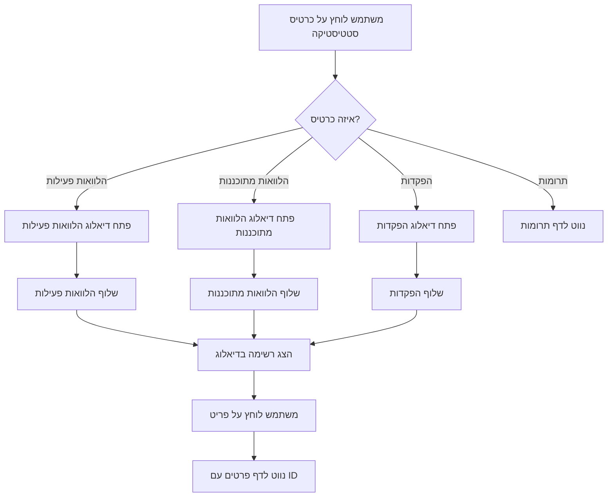

# מסמך עיצוב

## סקירה כללית

תכונה זו מוסיפה אינטראקטיביות לכרטיסי הסטטיסטיקה בלוח הבקרה. המימוש יכלול:

1. הוספת מטפלי אירועי לחיצה לכרטיסי הסטטיסטיקה
2. יצירת רכיב דיאלוג לשימוש חוזר להצגת רשימות
3. שליפת נתונים מפורטים עבור הלוואות והפקדות
4. ניווט לדפים ספציפיים עם הקשר מתאים

העיצוב שומר על המבנה הקיים של לוח הבקרה ומוסיף פונקציונליות חדשה בצורה מודולרית.

## ארכיטקטורה

### רכיבים קיימים שישונו

1. **Dashboard.tsx**: הרכיב הראשי שיעודכן עם:
   - מטפלי אירועי לחיצה לכרטיסי סטטיסטיקה
   - ניהול מצב עבור דיאלוגים
   - שליפת נתונים מפורטים

### רכיבים חדשים

1. **ItemsListDialog.tsx**: רכיב דיאלוג לשימוש חוזר גנרי
   - מקבל רשימת פריטים, הגדרות עמודות ומטפל לחיצה
   - מציג טבלה עם גלילה
   - תומך בהודעות ריקות ומצבי טעינה

### תרשים זרימה



## רכיבים וממשקים

### 1. רכיב ItemsListDialog

רכיב דיאלוג גנרי לשימוש חוזר להצגת רשימות פריטים.

**Props:**

```typescript
interface ItemsListDialogProps<T> {
  open: boolean
  onClose: () => void
  title: string
  items: T[]
  columns: ColumnDefinition<T>[]
  onItemClick: (item: T) => void
  loading?: boolean
  emptyMessage?: string
}

interface ColumnDefinition<T> {
  id: string
  label: string
  align?: 'left' | 'center' | 'right'
  format?: (item: T) => string | React.ReactNode
}
```

**התנהגות:**

- מציג דיאלוג מודאלי עם כותרת וכפתור סגירה
- מציג טבלה עם עמודות מוגדרות
- כל שורה ניתנת ללחיצה ומפעילה את `onItemClick`
- מציג אינדיקטור טעינה כאשר `loading=true`
- מציג הודעה כאשר `items` ריק

### 2. עדכוני Dashboard.tsx

**מצב חדש:**

```typescript
const [activeLoansDialogOpen, setActiveLoansDialogOpen] = useState(false)
const [scheduledLoansDialogOpen, setScheduledLoansDialogOpen] = useState(false)
const [depositsDialogOpen, setDepositsDialogOpen] = useState(false)
const [activeLoans, setActiveLoans] = useState<Loan[]>([])
const [scheduledLoans, setScheduledLoans] = useState<Loan[]>([])
const [deposits, setDeposits] = useState<Deposit[]>([])
const [dialogLoading, setDialogLoading] = useState(false)
```

**פונקציות חדשות:**

```typescript
// שליפת הלוואות פעילות
const fetchActiveLoans = async () => {
  setDialogLoading(true)
  try {
    const loans = await loansService.getAll()
    const active = loans.filter(l => l.status === 'active' && (l.remaining || 0) > 0)
    setActiveLoans(active)
  } catch (error) {
    console.error('Error fetching active loans:', error)
  } finally {
    setDialogLoading(false)
  }
}

// שליפת הלוואות מתוכננות
const fetchScheduledLoans = async () => {
  setDialogLoading(true)
  try {
    const loans = await loansService.getAll()
    const scheduled = loans.filter(l => l.status === 'planned')
      .sort((a, b) => new Date(a.loan_date).getTime() - new Date(b.loan_date).getTime())
    setScheduledLoans(scheduled)
  } catch (error) {
    console.error('Error fetching scheduled loans:', error)
  } finally {
    setDialogLoading(false)
  }
}

// שליפת הפקדות
const fetchDeposits = async () => {
  setDialogLoading(true)
  try {
    const allDeposits = await db.query('SELECT * FROM deposits')
    const depositors = await db.query('SELECT * FROM depositors')
    const depositsWithNames = (allDeposits as any[]).map(d => ({
      ...d,
      depositor_name: depositors.find((dep: any) => dep.id === d.depositor_id)?.first_name + ' ' + 
                      depositors.find((dep: any) => dep.id === d.depositor_id)?.last_name || ''
    }))
    setDeposits(depositsWithNames)
  } catch (error) {
    console.error('Error fetching deposits:', error)
  } finally {
    setDialogLoading(false)
  }
}

// מטפלי לחיצה
const handleActiveLoansClick = () => {
  fetchActiveLoans()
  setActiveLoansDialogOpen(true)
}

const handleScheduledLoansClick = () => {
  fetchScheduledLoans()
  setScheduledLoansDialogOpen(true)
}

const handleDepositsClick = () => {
  fetchDeposits()
  setDepositsDialogOpen(true)
}

const handleDonationsClick = () => {
  navigate('/donations')
}

// ניווט מדיאלוגים
const handleLoanItemClick = (loan: Loan) => {
  navigate(`/loans?loanId=${loan.id}`)
  setActiveLoansDialogOpen(false)
  setScheduledLoansDialogOpen(false)
}

const handleDepositItemClick = (deposit: any) => {
  navigate(`/donations?depositId=${deposit.id}`)
  setDepositsDialogOpen(false)
}
```

**עדכוני JSX לכרטיסים:**

```typescript
// הלוואות פעילות
<Card 
  sx={{ 
    bgcolor: 'primary.main', 
    color: 'white',
    cursor: 'pointer',
    '&:hover': {
      transform: 'translateY(-4px)',
      boxShadow: 4,
      transition: 'all 0.3s ease'
    }
  }}
  onClick={handleActiveLoansClick}
>
  {/* תוכן קיים */}
</Card>

// הלוואות מתוכננות
<Card 
  sx={{ 
    bgcolor: 'info.main', 
    color: 'white',
    cursor: 'pointer',
    '&:hover': {
      transform: 'translateY(-4px)',
      boxShadow: 4,
      transition: 'all 0.3s ease'
    }
  }}
  onClick={handleScheduledLoansClick}
>
  {/* תוכן קיים */}
</Card>

// הפקדות
<Card 
  sx={{ 
    bgcolor: 'success.main', 
    color: 'white',
    cursor: 'pointer',
    '&:hover': {
      transform: 'translateY(-4px)',
      boxShadow: 4,
      transition: 'all 0.3s ease'
    }
  }}
  onClick={handleDepositsClick}
>
  {/* תוכן קיים */}
</Card>

// תרומות
<Card 
  sx={{ 
    bgcolor: 'secondary.main', 
    color: 'white',
    cursor: 'pointer',
    '&:hover': {
      transform: 'translateY(-4px)',
      boxShadow: 4,
      transition: 'all 0.3s ease'
    }
  }}
  onClick={handleDonationsClick}
>
  {/* תוכן קיים */}
</Card>
```

## מודלי נתונים

### Loan (קיים)

```typescript
interface Loan {
  id: number
  borrower_id: number
  borrower_name?: string
  amount: number
  loan_date: string
  loan_date_hebrew?: string
  status: 'active' | 'planned' | 'completed'
  remaining?: number
  total_repaid?: number
  notes?: string
}
```

### Deposit (קיים)

```typescript
interface Deposit {
  id: number
  depositor_id: number
  depositor_name?: string
  amount: number
  deposit_date: string
  status: string
}
```

### הגדרות עמודות

**עמודות הלוואות פעילות:**

```typescript
const activeLoansColumns: ColumnDefinition<Loan>[] = [
  {
    id: 'borrower_name',
    label: 'שם לווה',
    align: 'right'
  },
  {
    id: 'amount',
    label: 'סכום הלוואה',
    align: 'center',
    format: (loan) => formatCurrency(loan.amount)
  },
  {
    id: 'remaining',
    label: 'יתרה',
    align: 'center',
    format: (loan) => formatCurrency(loan.remaining || 0)
  },
  {
    id: 'loan_date',
    label: 'תאריך',
    align: 'center',
    format: (loan) => new Date(loan.loan_date).toLocaleDateString('he-IL')
  }
]
```

**עמודות הלוואות מתוכננות:**

```typescript
const scheduledLoansColumns: ColumnDefinition<Loan>[] = [
  {
    id: 'borrower_name',
    label: 'שם לווה',
    align: 'right'
  },
  {
    id: 'amount',
    label: 'סכום',
    align: 'center',
    format: (loan) => formatCurrency(loan.amount)
  },
  {
    id: 'loan_date',
    label: 'תאריך מתוכנן',
    align: 'center',
    format: (loan) => new Date(loan.loan_date).toLocaleDateString('he-IL')
  }
]
```

**עמודות הפקדות:**

```typescript
const depositsColumns: ColumnDefinition<Deposit>[] = [
  {
    id: 'depositor_name',
    label: 'שם מפקיד',
    align: 'right'
  },
  {
    id: 'amount',
    label: 'סכום',
    align: 'center',
    format: (deposit) => formatCurrency(deposit.amount)
  },
  {
    id: 'deposit_date',
    label: 'תאריך',
    align: 'center',
    format: (deposit) => new Date(deposit.deposit_date).toLocaleDateString('he-IL')
  }
]
```


## מאפייני נכונות

מאפיין הוא תכונה או התנהגות שצריכה להתקיים בכל ביצועי המערכת התקינים - למעשה, הצהרה פורמלית על מה שהמערכת צריכה לעשות. מאפיינים משמשים כגשר בין מפרטים קריאים לאדם לבין ערבויות נכונות הניתנות לאימות מכני.

### מאפיין 1: לחיצה על כרטיס פותחת דיאלוג עם נתונים מתאימים

*עבור כל* כרטיס סטטיסטיקה אינטראקטיבי (הלוואות פעילות, הלוואות מתוכננות, הפקדות), לחיצה על הכרטיס צריכה לפתוח דיאלוג המכיל את כל הפריטים המתאימים לאותה קטגוריה.

**מאמת: דרישות 1.1, 2.1, 3.1**

### מאפיין 2: דיאלוג מציג את כל השדות הנדרשים

*עבור כל* פריט המוצג בדיאלוג, כל השדות הנדרשים (שם, סכום, תאריך) צריכים להיות נוכחים ומעוצבים נכון בתצוגה.

**מאמת: דרישות 1.2, 2.2, 3.2**

### מאפיין 3: לחיצה על פריט מנווטת עם ID נכון

*עבור כל* פריט בדיאלוג, לחיצה על הפריט צריכה לנווט לדף המתאים עם מזהה הפריט כפרמטר URL.

**מאמת: דרישות 1.3, 2.3, 3.3, 7.1, 7.2**

### מאפיין 4: פריטים בדיאלוג ממוינים נכון

*עבור כל* דיאלוג, הפריטים צריכים להיות ממוינים לפי התאריך המתאים (הלוואות פעילות והפקדות: האחרונות ראשונות, הלוואות מתוכננות: המוקדמות ראשונות).

**מאמת: דרישות 1.4, 2.4, 3.4**

### מאפיין 5: כרטיסים אינטראקטיביים בעלי עיצוב ריחוף עקבי

*עבור כל* כרטיס סטטיסטיקה אינטראקטיבי, הריחוף מעל הכרטיס צריך להחיל את אותם סגנונות (cursor: pointer, transform, boxShadow) באופן עקבי.

**מאמת: דרישות 5.1, 5.2, 5.3**

### מאפיין 6: רכיב דיאלוג תומך בהתאמה אישית

*עבור כל* שימוש ברכיב ItemsListDialog, הרכיב צריך להציג את הפריטים בטבלה עם העמודות המוגדרות, לנקות מצב בסגירה, ולתמוך בהגדרות עמודות שונות.

**מאמת: דרישות 6.3, 6.4, 6.5**

### מאפיין 7: שליפת נתונים אסינכרונית עם אינדיקטור טעינה

*עבור כל* פתיחת דיאלוג, הנתונים צריכים להישלף באופן אסינכרוני ואינדיקטור טעינה צריך להיות מוצג עד לסיום השליפה.

**מאמת: דרישות 8.1, 8.2**

## טיפול בשגיאות

### שגיאות שליפת נתונים

- אם שליפת הלוואות נכשלת, הצג הודעת שגיאה בדיאלוג
- אם שליפת הפקדות נכשלת, הצג הודעת שגיאה בדיאלוג
- כלול כפתור "נסה שוב" בהודעות שגיאה
- רשום שגיאות ל-console לצורכי דיבאג

### מקרי קצה

- רשימה ריקה: הצג הודעה "אין פריטים להצגה"
- נתונים חסרים: הצג "-" או "לא זמין" עבור שדות חסרים
- ניווט כושל: הצג הודעת שגיאה ואל תסגור את הדיאלוג

### אימות

- וודא שכל הלוואה מכילה borrower_name לפני הצגה
- וודא שכל הפקדה מכילה depositor_name לפני הצגה
- סנן הלוואות עם נתונים לא תקינים

## אסטרטגיית בדיקה

### גישת בדיקה כפולה

המימוש ישתמש בשילוב של:

1. **בדיקות יחידה (Unit Tests)**: לאימות דוגמאות ספציפיות, מקרי קצה ותנאי שגיאה
   - בדיקת רכיב ItemsListDialog עם props שונים
   - בדיקת פונקציות שליפת נתונים
   - בדיקת מטפלי אירועים
   - בדיקת מקרי קצה (רשימה ריקה, שגיאות)

2. **בדיקות מבוססות מאפיינים (Property-Based Tests)**: לאימות מאפיינים אוניברסליים על פני כל הקלטים
   - יצירת נתונים אקראיים (הלוואות, הפקדות)
   - אימות מיון נכון
   - אימות הצגת שדות
   - אימות ניווט עם IDs שונים

### תצורת בדיקות מבוססות מאפיינים

- ספריית בדיקה: **fast-check** (עבור TypeScript/JavaScript)
- מינימום 100 איטרציות לכל בדיקת מאפיין
- כל בדיקת מאפיין תתויג בהערה המפנה למאפיין בעיצוב
- פורמט תיוג: **Feature: dashboard-interactive-tables, Property {number}: {property_text}**
- כל מאפיין נכונות יומש על ידי בדיקת מאפיין אחת

### דוגמאות לבדיקות

**בדיקת יחידה - רשימה ריקה:**
```typescript
test('displays empty message when no items', () => {
  render(<ItemsListDialog open={true} items={[]} ... />)
  expect(screen.getByText('אין פריטים להצגה')).toBeInTheDocument()
})
```

**בדיקת מאפיין - מיון:**
```typescript
// Feature: dashboard-interactive-tables, Property 4: פריטים בדיאלוג ממוינים נכון
test('active loans are sorted by date descending', () => {
  fc.assert(
    fc.property(
      fc.array(loanArbitrary, { minLength: 2 }),
      (loans) => {
        const sorted = sortActiveLoans(loans)
        for (let i = 0; i < sorted.length - 1; i++) {
          expect(new Date(sorted[i].loan_date).getTime())
            .toBeGreaterThanOrEqual(new Date(sorted[i + 1].loan_date).getTime())
        }
      }
    ),
    { numRuns: 100 }
  )
})
```

**בדיקת מאפיין - הצגת שדות:**
```typescript
// Feature: dashboard-interactive-tables, Property 2: דיאלוג מציג את כל השדות הנדרשים
test('all required fields are displayed for each item', () => {
  fc.assert(
    fc.property(
      fc.array(loanArbitrary),
      (loans) => {
        const { container } = render(<ItemsListDialog items={loans} ... />)
        loans.forEach(loan => {
          expect(container.textContent).toContain(loan.borrower_name)
          expect(container.textContent).toContain(loan.amount.toString())
        })
      }
    ),
    { numRuns: 100 }
  )
})
```
