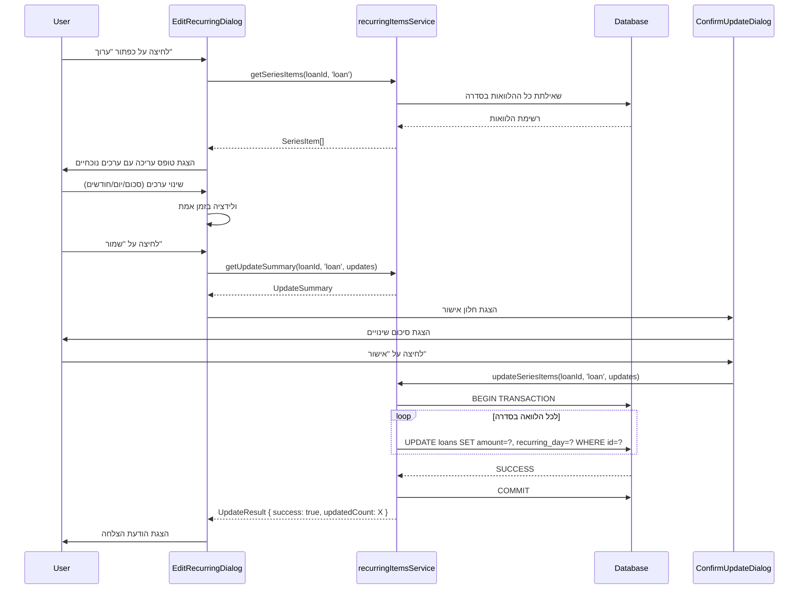
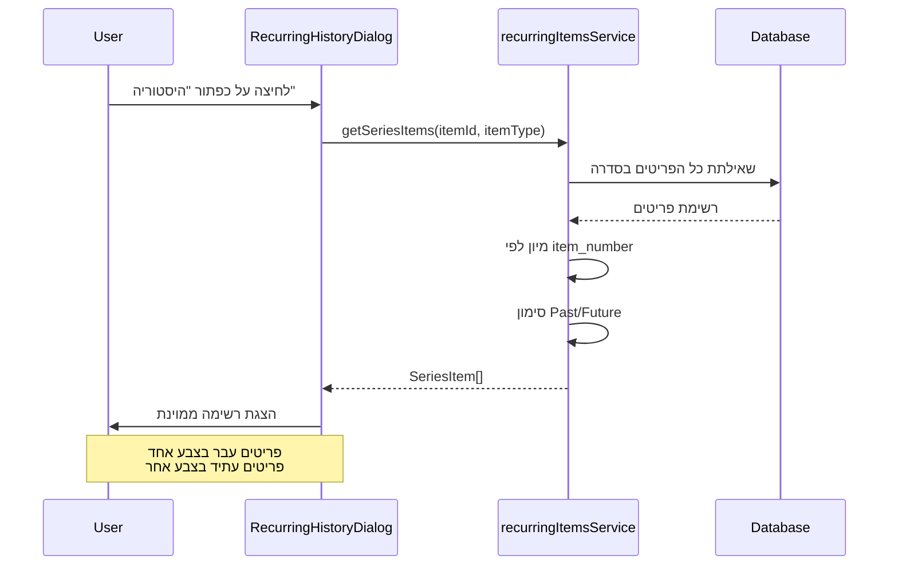
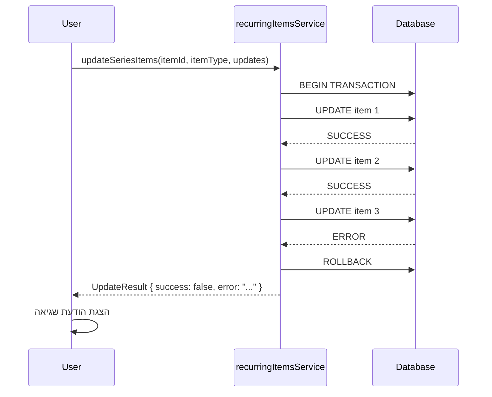
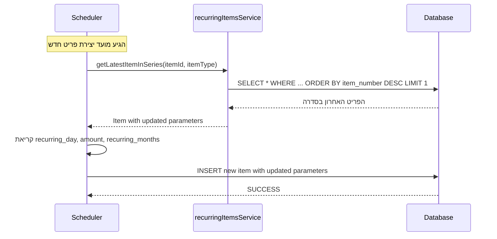

# מסמך עיצוב טכני - עריכת פריטים מחזוריים

## סקירה כללית (Overview)

תכונה זו מאפשרת עריכה וניהול של פריטים מחזוריים (הלוואות, פירעונות והפקדות) שכבר נוצרו במערכת. המערכת תאפשר למשתמש לערוך פרמטרים מחזוריים (סכום, יום גבייה, משך), להציג היסטוריה של כל הפריטים בסדרה, ולעדכן את **כל הפריטים בסדרה** - גם אלו שכבר נוצרו וגם אלו שעתידים להיווצר.

### מטרות העיצוב

1. **עקביות**: כל הפריטים בסדרה מחזורית יעודכנו באופן אחיד
2. **שלמות נתונים**: שמירה על תאריכים ומספרים סידוריים תוך עדכון פרמטרים
3. **אינטגרציה**: ה-Scheduler ישתמש בפרמטרים המעודכנים ליצירת פריטים עתידיים
4. **בטיחות**: אישור משתמש לפני עדכון פריטים קיימים
5. **נגישות**: ממשק משתמש ברור ונוח בעברית (RTL)

### הגבלות ואילוצים

- רק הפריט המקורי (Original_Item) ניתן לעריכה
- תאריכים ומספרים סידוריים לא ישתנו
- עדכון יתבצע בטרנזקציה אחת (all-or-nothing)
- תמיכה ב-3 סוגי פריטים: הלוואות, פירעונות, הפקדות

## ארכיטקטורה (Architecture)

### מבנה כללי

```
┌─────────────────────────────────────────────────────────────┐
│                        UI Layer                              │
│  ┌──────────────┐  ┌──────────────┐  ┌──────────────┐      │
│  │ Edit Dialog  │  │ History View │  │ Confirm Dialog│      │
│  └──────────────┘  └──────────────┘  └──────────────┘      │
└─────────────────────────────────────────────────────────────┘
                            │
                            ▼
┌─────────────────────────────────────────────────────────────┐
│                     Service Layer                            │
│  ┌──────────────────────────────────────────────────────┐   │
│  │  recurringItemsService                                │   │
│  │  - getSeriesItems()                                   │   │
│  │  - updateSeriesItems()                                │   │
│  │  - validateUpdate()                                   │   │
│  └──────────────────────────────────────────────────────┘   │
└─────────────────────────────────────────────────────────────┘
                            │
                            ▼
┌─────────────────────────────────────────────────────────────┐
│                     Data Layer                               │
│  ┌──────────────┐  ┌──────────────┐  ┌──────────────┐      │
│  │ loansService │  │repaymentsServ│  │ db.query()   │      │
│  └──────────────┘  └──────────────┘  └──────────────┘      │
└─────────────────────────────────────────────────────────────┘
                            │
                            ▼
┌─────────────────────────────────────────────────────────────┐
│                     Scheduler                                │
│  - autoCreateRecurringLoans()                                │
│  - autoCreateRecurringDeposits()                             │
│  - processAutoRepayment()                                    │
└─────────────────────────────────────────────────────────────┘
```

### שכבות המערכת

#### 1. UI Layer (שכבת ממשק משתמש)
- **EditRecurringDialog**: חלון עריכה לפרמטרים מחזוריים
- **RecurringHistoryDialog**: תצוגת היסטוריה של כל הפריטים בסדרה
- **ConfirmUpdateDialog**: חלון אישור לפני ביצוע עדכון
- **כפתורי פעולה**: בטבלאות הקיימות (LoansTab, DepositsTab, וכו')

#### 2. Service Layer (שכבת לוגיקה עסקית)
- **recurringItemsService**: שירות חדש לניהול פריטים מחזוריים
  - זיהוי פריטים בסדרה
  - עדכון כל הפריטים בסדרה
  - ולידציה של שינויים
  - ניהול טרנזקציות

#### 3. Data Layer (שכבת נתונים)
- שימוש בשירותים קיימים: `loansService`, `repaymentsService`, `db`
- הוספת פונקציות עזר לזיהוי סדרות
- עדכון בטרנזקציה אחת

#### 4. Scheduler Integration
- קריאת פרמטרים מהפריט האחרון בסדרה
- יצירת פריטים עתידיים עם ערכים מעודכנים

## רכיבים וממשקים (Components and Interfaces)

### 1. רכיבי UI

#### EditRecurringDialog

```typescript
interface EditRecurringDialogProps {
  open: boolean
  onClose: () => void
  itemType: 'loan' | 'repayment' | 'deposit'
  itemId: number
  onSuccess: () => void
}

interface EditRecurringFormData {
  recurring_day?: number      // יום בחודש (1-31)
  recurring_amount?: number    // סכום
  recurring_months?: number    // מספר חודשים נותרים (הלוואות/הפקדות)
}
```

**תכונות**:
- שדות עריכה לפי סוג הפריט
- ולידציה בזמן אמת
- הצגת ערכים נוכחיים
- כפתורי "שמור" ו-"ביטול"
- תמיכה ב-RTL

#### RecurringHistoryDialog

```typescript
interface RecurringHistoryDialogProps {
  open: boolean
  onClose: () => void
  itemType: 'loan' | 'repayment' | 'deposit'
  itemId: number
}

interface SeriesItem {
  id: number
  item_number: number          // מספר בסדרה
  date: string                 // תאריך (loan_date/payment_date/deposit_date)
  amount: number
  status: string
  isPast: boolean              // האם התאריך עבר
}
```

**תכונות**:
- רשימה ממוינת לפי מספר בסדרה
- סימון ויזואלי של פריטים עבר/עתיד
- הצגת סה"כ פריטים בסדרה
- גלילה לפריטים רבים

#### ConfirmUpdateDialog

```typescript
interface ConfirmUpdateDialogProps {
  open: boolean
  onClose: () => void
  onConfirm: () => void
  changes: UpdateSummary
}

interface UpdateSummary {
  totalItems: number           // סה"כ פריטים שיעודכנו
  pastItems: number            // פריטים שכבר נוצרו
  futureItems: number          // פריטים עתידיים
  changes: {
    field: string
    oldValue: any
    newValue: any
  }[]
}
```

**תכונות**:
- הצגה ברורה של מספר הפריטים שיעודכנו
- פירוט השינויים המדויקים
- כפתורי "אישור" ו-"ביטול"
- אזהרה ויזואלית

### 2. שירותים (Services)

#### recurringItemsService

```typescript
interface RecurringItemsService {
  // זיהוי פריטים בסדרה
  getSeriesItems(
    itemId: number,
    itemType: 'loan' | 'repayment' | 'deposit'
  ): Promise<SeriesItem[]>
  
  // עדכון כל הפריטים בסדרה
  updateSeriesItems(
    itemId: number,
    itemType: 'loan' | 'repayment' | 'deposit',
    updates: Partial<EditRecurringFormData>
  ): Promise<UpdateResult>
  
  // ולידציה
  validateUpdate(
    itemId: number,
    itemType: 'loan' | 'repayment' | 'deposit',
    updates: Partial<EditRecurringFormData>
  ): Promise<ValidationResult>
  
  // קבלת סיכום עדכון
  getUpdateSummary(
    itemId: number,
    itemType: 'loan' | 'repayment' | 'deposit',
    updates: Partial<EditRecurringFormData>
  ): Promise<UpdateSummary>
}

interface UpdateResult {
  success: boolean
  updatedCount: number
  error?: string
}

interface ValidationResult {
  valid: boolean
  errors: string[]
}
```

### 3. זיהוי פריטים בסדרה

#### הלוואות (Loans)
```typescript
// פריטים באותה סדרה מזוהים לפי:
{
  borrower_id: number,
  amount: number,
  recurring_day: number,
  is_recurring: 1
}
```

#### פירעונות (Repayments)
```typescript
// פריטים באותה סדרה מזוהים לפי:
{
  loan_id: number,
  is_recurring: 1
}
```

#### הפקדות (Deposits)
```typescript
// פריטים באותה סדרה מזוהים לפי:
{
  depositor_id: number,
  amount: number,
  recurring_day: number,
  is_recurring: 1
}
```

## מודלים של נתונים (Data Models)

### מבני נתונים קיימים

#### Loan (הלוואה)
```typescript
interface Loan {
  id: number
  borrower_id: number
  amount: number
  loan_date: string
  due_date?: string
  is_recurring: number
  recurring_months?: number
  recurring_day?: number
  recurring_loan_number?: number
  recurring_loan_count?: number
  // ... שדות נוספים
}
```

#### Repayment (פירעון)
```typescript
interface Repayment {
  id: number
  loan_id: number
  amount: number
  payment_date: string
  is_recurring?: number
  recurring_repayment_number?: number
  recurring_repayment_count?: number
  // ... שדות נוספים
}
```

#### Deposit (הפקדה)
```typescript
interface Deposit {
  id: number
  depositor_id: number
  amount: number
  deposit_date: string
  is_recurring: number
  recurring_day?: number
  recurring_months?: number
  recurring_deposit_number?: number
  recurring_deposit_count?: number
  // ... שדות נוספים
}
```

### שדות שיעודכנו

| שדה | הלוואות | פירעונות | הפקדות | הערות |
|-----|---------|----------|---------|-------|
| `amount` | ✓ | ✓ | ✓ | סכום הפריט |
| `recurring_day` | ✓ | ✓ | ✓ | יום בחודש |
| `recurring_months` | ✓ | ✗ | ✓ | מספר חודשים נותרים |

### שדות שלא ישתנו

- `id` - מזהה ייחודי
- `loan_date` / `payment_date` / `deposit_date` - תאריכים
- `recurring_loan_number` / `recurring_repayment_number` / `recurring_deposit_number` - מספר בסדרה
- `recurring_loan_count` / `recurring_repayment_count` / `recurring_deposit_count` - סה"כ בסדרה
- `status` - מצב הפריט
- `created_at` - תאריך יצירה

## טיפול בשגיאות (Error Handling)

### סוגי שגיאות

#### 1. שגיאות ולידציה
```typescript
enum ValidationError {
  INVALID_DAY = 'יום חייב להיות בין 1 ל-31',
  INVALID_AMOUNT = 'סכום חייב להיות גדול מ-0',
  INVALID_MONTHS = 'מספר חודשים חייב להיות 0 או יותר',
  NOT_ORIGINAL_ITEM = 'ניתן לערוך רק את הפריט המקורי',
  ITEM_NOT_FOUND = 'הפריט לא נמצא',
  NOT_RECURRING = 'הפריט אינו מחזורי'
}
```

#### 2. שגיאות עדכון
```typescript
enum UpdateError {
  TRANSACTION_FAILED = 'העדכון נכשל - לא בוצעו שינויים',
  PARTIAL_UPDATE = 'חלק מהפריטים לא עודכנו',
  DATABASE_ERROR = 'שגיאת מסד נתונים',
  PERMISSION_DENIED = 'אין הרשאה לבצע פעולה זו'
}
```

### אסטרטגיית טיפול בשגיאות

1. **ולידציה מקדימה**: בדיקת תקינות לפני שליחה לשרת
2. **טרנזקציות**: שימוש ב-try-catch עם rollback
3. **הודעות ברורות**: הצגת הודעות שגיאה מפורטות למשתמש
4. **לוגים**: רישום שגיאות ל-console לצורכי debug
5. **התאוששות**: אפשרות לנסות שוב או לבטל

### דוגמה לטיפול בשגיאות

```typescript
async function updateSeriesItems(
  itemId: number,
  itemType: string,
  updates: any
): Promise<UpdateResult> {
  try {
    // ולידציה
    const validation = await validateUpdate(itemId, itemType, updates)
    if (!validation.valid) {
      return {
        success: false,
        updatedCount: 0,
        error: validation.errors.join(', ')
      }
    }
    
    // קבלת כל הפריטים בסדרה
    const seriesItems = await getSeriesItems(itemId, itemType)
    
    // עדכון בטרנזקציה
    let updatedCount = 0
    for (const item of seriesItems) {
      try {
        await updateSingleItem(item.id, itemType, updates)
        updatedCount++
      } catch (error) {
        // rollback - החזרת כל השינויים
        console.error(`Failed to update item ${item.id}:`, error)
        throw new Error('Transaction failed - rolling back')
      }
    }
    
    return {
      success: true,
      updatedCount
    }
  } catch (error) {
    console.error('Error updating series:', error)
    return {
      success: false,
      updatedCount: 0,
      error: error.message
    }
  }
}
```

## אסטרטגיית בדיקות (Testing Strategy)

### סוגי בדיקות

#### 1. Unit Tests (בדיקות יחידה)
- בדיקת פונקציות זיהוי סדרות
- בדיקת ולידציה
- בדיקת חישובים (Series_Count)

#### 2. Integration Tests (בדיקות אינטגרציה)
- בדיקת עדכון מלא של סדרה
- בדיקת אינטגרציה עם Scheduler
- בדיקת rollback במקרה של כשלון

#### 3. UI Tests (בדיקות ממשק משתמש)
- בדיקת פתיחה וסגירה של דיאלוגים
- בדיקת ולידציה בזמן אמת
- בדיקת הצגת היסטוריה

### תרחישי בדיקה עיקריים

#### תרחיש 1: עדכון סכום בהלוואה מחזורית
```typescript
test('should update amount in all loans in series', async () => {
  // Arrange
  const originalLoan = await createRecurringLoan({
    borrower_id: 1,
    amount: 1000,
    recurring_months: 3,
    recurring_day: 5
  })
  
  // יצירת 2 הלוואות נוספות בסדרה
  await createRecurringLoan({ ...originalLoan, recurring_loan_number: 2 })
  await createRecurringLoan({ ...originalLoan, recurring_loan_number: 3 })
  
  // Act
  const result = await updateSeriesItems(originalLoan.id, 'loan', {
    recurring_amount: 1500
  })
  
  // Assert
  expect(result.success).toBe(true)
  expect(result.updatedCount).toBe(3)
  
  const updatedLoans = await getSeriesItems(originalLoan.id, 'loan')
  updatedLoans.forEach(loan => {
    expect(loan.amount).toBe(1500)
  })
})
```

#### תרחיש 2: עדכון יום גבייה
```typescript
test('should update recurring_day in all items', async () => {
  // בדיקה שכל הפריטים בסדרה מקבלים את היום החדש
})
```

#### תרחיש 3: rollback במקרה של כשלון
```typescript
test('should rollback all changes if one update fails', async () => {
  // בדיקה שאם עדכון אחד נכשל, כל השינויים מתבטלים
})
```

#### תרחיש 4: אינטגרציה עם Scheduler
```typescript
test('scheduler should use updated parameters', async () => {
  // בדיקה שה-Scheduler קורא את הפרמטרים המעודכנים
})
```


## זרימות עבודה (Workflows)

### זרימה 1: עריכת הלוואה מחזורית



### זרימה 2: הצגת היסטוריה



### זרימה 3: עדכון עם rollback



### זרימה 4: אינטגרציה עם Scheduler



## שיקולי ביצועים (Performance Considerations)

### 1. אופטימיזציה של שאילתות

#### זיהוי סדרות - שימוש באינדקסים
```sql
-- הלוואות
CREATE INDEX idx_loans_series ON loans(borrower_id, amount, recurring_day, is_recurring);

-- פירעונות
CREATE INDEX idx_repayments_series ON repayments(loan_id, is_recurring);

-- הפקדות
CREATE INDEX idx_deposits_series ON deposits(depositor_id, amount, recurring_day, is_recurring);
```

#### שאילתה מותאמת לזיהוי סדרה
```typescript
// במקום לטעון את כל הפריטים ולסנן בזיכרון
async function getSeriesItems(itemId: number, itemType: 'loan'): Promise<SeriesItem[]> {
  const originalItem = await loansService.getById(itemId)
  
  // שאילתה ממוקדת
  const query = `
    SELECT * FROM loans 
    WHERE borrower_id = ? 
      AND amount = ? 
      AND recurring_day = ? 
      AND is_recurring = 1
      AND is_deleted = 0
    ORDER BY recurring_loan_number ASC
  `
  
  return await db.query(query, [
    originalItem.borrower_id,
    originalItem.amount,
    originalItem.recurring_day
  ])
}
```

### 2. עדכון בטרנזקציה

```typescript
async function updateSeriesItems(
  itemId: number,
  itemType: string,
  updates: any
): Promise<UpdateResult> {
  const seriesItems = await getSeriesItems(itemId, itemType)
  
  // עדכון בטרנזקציה אחת
  try {
    // במקום לעדכן פריט אחד בכל פעם, נשתמש ב-batch update
    const ids = seriesItems.map(item => item.id)
    
    if (itemType === 'loan') {
      await db.run(`
        UPDATE loans 
        SET amount = ?, recurring_day = ?, recurring_months = ?
        WHERE id IN (${ids.join(',')})
      `, [updates.recurring_amount, updates.recurring_day, updates.recurring_months])
    }
    
    return { success: true, updatedCount: ids.length }
  } catch (error) {
    console.error('Update failed:', error)
    return { success: false, updatedCount: 0, error: error.message }
  }
}
```

### 3. Caching

```typescript
// Cache לפריטים בסדרה (תקף ל-5 דקות)
const seriesCache = new Map<string, { items: SeriesItem[], timestamp: number }>()
const CACHE_TTL = 5 * 60 * 1000 // 5 minutes

async function getSeriesItems(itemId: number, itemType: string): Promise<SeriesItem[]> {
  const cacheKey = `${itemType}_${itemId}`
  const cached = seriesCache.get(cacheKey)
  
  if (cached && Date.now() - cached.timestamp < CACHE_TTL) {
    return cached.items
  }
  
  const items = await fetchSeriesItemsFromDB(itemId, itemType)
  seriesCache.set(cacheKey, { items, timestamp: Date.now() })
  
  return items
}

// ניקוי cache אחרי עדכון
function invalidateSeriesCache(itemId: number, itemType: string) {
  const cacheKey = `${itemType}_${itemId}`
  seriesCache.delete(cacheKey)
}
```

### 4. Lazy Loading בהיסטוריה

```typescript
// טעינת פריטים בחלקים (pagination)
interface HistoryPaginationProps {
  page: number
  pageSize: number
}

async function getSeriesItemsPaginated(
  itemId: number,
  itemType: string,
  pagination: HistoryPaginationProps
): Promise<{ items: SeriesItem[], total: number }> {
  const offset = pagination.page * pagination.pageSize
  
  const items = await db.query(`
    SELECT * FROM ${getTableName(itemType)}
    WHERE ... 
    ORDER BY item_number ASC
    LIMIT ? OFFSET ?
  `, [pagination.pageSize, offset])
  
  const total = await db.get(`
    SELECT COUNT(*) as count FROM ${getTableName(itemType)}
    WHERE ...
  `)
  
  return { items, total: total.count }
}
```

## שיקולי אבטחה (Security Considerations)

### 1. ולידציה מקיפה

```typescript
function validateRecurringUpdate(updates: Partial<EditRecurringFormData>): ValidationResult {
  const errors: string[] = []
  
  // בדיקת יום
  if (updates.recurring_day !== undefined) {
    if (updates.recurring_day < 1 || updates.recurring_day > 31) {
      errors.push('יום חייב להיות בין 1 ל-31')
    }
    if (!Number.isInteger(updates.recurring_day)) {
      errors.push('יום חייב להיות מספר שלם')
    }
  }
  
  // בדיקת סכום
  if (updates.recurring_amount !== undefined) {
    if (updates.recurring_amount <= 0) {
      errors.push('סכום חייב להיות גדול מ-0')
    }
    if (!Number.isFinite(updates.recurring_amount)) {
      errors.push('סכום לא תקין')
    }
  }
  
  // בדיקת חודשים
  if (updates.recurring_months !== undefined) {
    if (updates.recurring_months < 0) {
      errors.push('מספר חודשים חייב להיות 0 או יותר')
    }
    if (!Number.isInteger(updates.recurring_months)) {
      errors.push('מספר חודשים חייב להיות מספר שלם')
    }
  }
  
  return {
    valid: errors.length === 0,
    errors
  }
}
```

### 2. הרשאות

```typescript
async function canEditRecurringItem(itemId: number, itemType: string): Promise<boolean> {
  const item = await getItem(itemId, itemType)
  
  // רק הפריט המקורי ניתן לעריכה
  const itemNumber = getItemNumber(item, itemType)
  if (itemNumber !== 1) {
    throw new Error('ניתן לערוך רק את הפריט המקורי בסדרה')
  }
  
  // בדיקה שהפריט מחזורי
  if (!item.is_recurring) {
    throw new Error('הפריט אינו מחזורי')
  }
  
  return true
}
```

### 3. SQL Injection Prevention

```typescript
// שימוש ב-parameterized queries
async function updateSeriesItems(itemId: number, itemType: string, updates: any) {
  // ❌ לא נכון - פגיע ל-SQL injection
  // const query = `UPDATE loans SET amount = ${updates.amount} WHERE id = ${itemId}`
  
  // ✅ נכון - שימוש ב-parameters
  const query = `UPDATE loans SET amount = ? WHERE id = ?`
  await db.run(query, [updates.amount, itemId])
}
```

### 4. Rate Limiting

```typescript
// הגבלת מספר עדכונים בזמן נתון
const updateRateLimiter = new Map<number, number>()
const MAX_UPDATES_PER_MINUTE = 10

async function checkRateLimit(itemId: number): Promise<boolean> {
  const now = Date.now()
  const lastUpdate = updateRateLimiter.get(itemId) || 0
  
  if (now - lastUpdate < 60000 / MAX_UPDATES_PER_MINUTE) {
    throw new Error('יותר מדי עדכונים - נסה שוב בעוד כמה שניות')
  }
  
  updateRateLimiter.set(itemId, now)
  return true
}
```

### 5. Audit Log

```typescript
interface AuditLogEntry {
  timestamp: string
  userId?: number
  action: 'update_series'
  itemType: string
  itemId: number
  changes: any
  affectedItems: number[]
}

async function logSeriesUpdate(
  itemId: number,
  itemType: string,
  updates: any,
  affectedItems: number[]
) {
  const logEntry: AuditLogEntry = {
    timestamp: new Date().toISOString(),
    action: 'update_series',
    itemType,
    itemId,
    changes: updates,
    affectedItems
  }
  
  // שמירה ב-localStorage או שליחה לשרת
  const logs = JSON.parse(localStorage.getItem('audit_log') || '[]')
  logs.push(logEntry)
  localStorage.setItem('audit_log', JSON.stringify(logs))
}
```

## פרטי יישום נוספים

### 1. ממשק API מפורט

#### getSeriesItems

```typescript
/**
 * מחזיר את כל הפריטים בסדרה מחזורית
 * @param itemId - מזהה הפריט
 * @param itemType - סוג הפריט ('loan' | 'repayment' | 'deposit')
 * @returns רשימת פריטים ממוינת לפי מספר בסדרה
 */
async function getSeriesItems(
  itemId: number,
  itemType: 'loan' | 'repayment' | 'deposit'
): Promise<SeriesItem[]> {
  // 1. קבלת הפריט המקורי
  const originalItem = await getOriginalItem(itemId, itemType)
  
  // 2. זיהוי פריטים בסדרה לפי קריטריונים
  const seriesItems = await identifySeriesItems(originalItem, itemType)
  
  // 3. מיון לפי מספר בסדרה
  seriesItems.sort((a, b) => a.item_number - b.item_number)
  
  // 4. סימון Past/Future
  const today = new Date().toISOString().split('T')[0]
  seriesItems.forEach(item => {
    item.isPast = item.date <= today
  })
  
  return seriesItems
}
```

#### updateSeriesItems

```typescript
/**
 * מעדכן את כל הפריטים בסדרה
 * @param itemId - מזהה הפריט המקורי
 * @param itemType - סוג הפריט
 * @param updates - השינויים לביצוע
 * @returns תוצאת העדכון
 */
async function updateSeriesItems(
  itemId: number,
  itemType: 'loan' | 'repayment' | 'deposit',
  updates: Partial<EditRecurringFormData>
): Promise<UpdateResult> {
  // 1. ולידציה
  await canEditRecurringItem(itemId, itemType)
  const validation = validateRecurringUpdate(updates)
  if (!validation.valid) {
    return {
      success: false,
      updatedCount: 0,
      error: validation.errors.join(', ')
    }
  }
  
  // 2. קבלת כל הפריטים בסדרה
  const seriesItems = await getSeriesItems(itemId, itemType)
  
  // 3. עדכון בטרנזקציה
  try {
    let updatedCount = 0
    
    for (const item of seriesItems) {
      await updateSingleItem(item.id, itemType, updates)
      updatedCount++
    }
    
    // 4. Audit log
    await logSeriesUpdate(
      itemId,
      itemType,
      updates,
      seriesItems.map(i => i.id)
    )
    
    // 5. ניקוי cache
    invalidateSeriesCache(itemId, itemType)
    
    return {
      success: true,
      updatedCount
    }
  } catch (error) {
    console.error('Update failed:', error)
    return {
      success: false,
      updatedCount: 0,
      error: error.message
    }
  }
}
```

#### getUpdateSummary

```typescript
/**
 * מחזיר סיכום של השינויים שיבוצעו
 * @param itemId - מזהה הפריט
 * @param itemType - סוג הפריט
 * @param updates - השינויים המוצעים
 * @returns סיכום מפורט
 */
async function getUpdateSummary(
  itemId: number,
  itemType: 'loan' | 'repayment' | 'deposit',
  updates: Partial<EditRecurringFormData>
): Promise<UpdateSummary> {
  const seriesItems = await getSeriesItems(itemId, itemType)
  const originalItem = seriesItems[0]
  const today = new Date().toISOString().split('T')[0]
  
  const pastItems = seriesItems.filter(item => item.date <= today).length
  const futureItems = seriesItems.filter(item => item.date > today).length
  
  const changes = []
  
  if (updates.recurring_amount !== undefined && updates.recurring_amount !== originalItem.amount) {
    changes.push({
      field: 'סכום',
      oldValue: `${originalItem.amount} ₪`,
      newValue: `${updates.recurring_amount} ₪`
    })
  }
  
  if (updates.recurring_day !== undefined && updates.recurring_day !== originalItem.recurring_day) {
    changes.push({
      field: 'יום גבייה',
      oldValue: originalItem.recurring_day,
      newValue: updates.recurring_day
    })
  }
  
  if (updates.recurring_months !== undefined && updates.recurring_months !== originalItem.recurring_months) {
    changes.push({
      field: 'חודשים נותרים',
      oldValue: originalItem.recurring_months,
      newValue: updates.recurring_months
    })
  }
  
  return {
    totalItems: seriesItems.length,
    pastItems,
    futureItems,
    changes
  }
}
```

### 2. אינטגרציה עם Scheduler

#### עדכון Scheduler לקריאת פרמטרים מעודכנים

```typescript
// בקובץ scheduler.ts

async function autoCreateRecurringLoans(): Promise<void> {
  const allLoans = await loansService.getAll()
  
  for (const loan of allLoans) {
    if (!loan.is_recurring || loan.recurring_months <= 0) continue
    
    // ✅ קריאת הפרמטרים מהפריט האחרון בסדרה
    const latestLoan = await getLatestLoanInSeries(loan)
    
    // שימוש בפרמטרים המעודכנים
    const recurringDay = latestLoan.recurring_day
    const amount = latestLoan.amount
    const recurringMonths = latestLoan.recurring_months
    
    // המשך הלוגיקה...
  }
}

/**
 * מחזיר את הפריט האחרון בסדרה (עם המספר הגבוה ביותר)
 */
async function getLatestLoanInSeries(loan: Loan): Promise<Loan> {
  const seriesLoans = await db.query(`
    SELECT * FROM loans
    WHERE borrower_id = ?
      AND amount = ?
      AND is_recurring = 1
      AND is_deleted = 0
    ORDER BY recurring_loan_number DESC
    LIMIT 1
  `, [loan.borrower_id, loan.amount])
  
  return seriesLoans[0] || loan
}
```

### 3. רכיבי UI מפורטים

#### EditRecurringDialog - קוד לדוגמה

```typescript
import React, { useState, useEffect } from 'react'
import {
  Dialog,
  DialogTitle,
  DialogContent,
  DialogActions,
  TextField,
  Button,
  CircularProgress,
  Alert
} from '@mui/material'
import { recurringItemsService } from '../services/recurringItemsService'

interface EditRecurringDialogProps {
  open: boolean
  onClose: () => void
  itemType: 'loan' | 'repayment' | 'deposit'
  itemId: number
  onSuccess: () => void
}

export function EditRecurringDialog({
  open,
  onClose,
  itemType,
  itemId,
  onSuccess
}: EditRecurringDialogProps) {
  const [loading, setLoading] = useState(false)
  const [error, setError] = useState<string | null>(null)
  const [formData, setFormData] = useState({
    recurring_day: 1,
    recurring_amount: 0,
    recurring_months: 0
  })
  const [showConfirm, setShowConfirm] = useState(false)
  const [updateSummary, setUpdateSummary] = useState<UpdateSummary | null>(null)
  
  // טעינת נתונים ראשונית
  useEffect(() => {
    if (open) {
      loadInitialData()
    }
  }, [open, itemId])
  
  async function loadInitialData() {
    setLoading(true)
    try {
      const item = await recurringItemsService.getItem(itemId, itemType)
      setFormData({
        recurring_day: item.recurring_day || 1,
        recurring_amount: item.amount,
        recurring_months: item.recurring_months || 0
      })
    } catch (err) {
      setError('שגיאה בטעינת נתונים')
    } finally {
      setLoading(false)
    }
  }
  
  async function handleSave() {
    setLoading(true)
    setError(null)
    
    try {
      // קבלת סיכום עדכון
      const summary = await recurringItemsService.getUpdateSummary(
        itemId,
        itemType,
        formData
      )
      
      setUpdateSummary(summary)
      setShowConfirm(true)
    } catch (err) {
      setError(err.message)
    } finally {
      setLoading(false)
    }
  }
  
  async function handleConfirm() {
    setLoading(true)
    setError(null)
    
    try {
      const result = await recurringItemsService.updateSeriesItems(
        itemId,
        itemType,
        formData
      )
      
      if (result.success) {
        onSuccess()
        onClose()
      } else {
        setError(result.error || 'שגיאה בעדכון')
      }
    } catch (err) {
      setError(err.message)
    } finally {
      setLoading(false)
      setShowConfirm(false)
    }
  }
  
  return (
    <>
      <Dialog open={open && !showConfirm} onClose={onClose} maxWidth="sm" fullWidth>
        <DialogTitle>עריכת פריט מחזורי</DialogTitle>
        <DialogContent>
          {error && <Alert severity="error" sx={{ mb: 2 }}>{error}</Alert>}
          
          <TextField
            label="יום בחודש"
            type="number"
            value={formData.recurring_day}
            onChange={(e) => setFormData({ ...formData, recurring_day: parseInt(e.target.value) })}
            fullWidth
            margin="normal"
            inputProps={{ min: 1, max: 31 }}
          />
          
          <TextField
            label="סכום"
            type="number"
            value={formData.recurring_amount}
            onChange={(e) => setFormData({ ...formData, recurring_amount: parseFloat(e.target.value) })}
            fullWidth
            margin="normal"
            inputProps={{ min: 0, step: 0.01 }}
          />
          
          {(itemType === 'loan' || itemType === 'deposit') && (
            <TextField
              label="חודשים נותרים"
              type="number"
              value={formData.recurring_months}
              onChange={(e) => setFormData({ ...formData, recurring_months: parseInt(e.target.value) })}
              fullWidth
              margin="normal"
              inputProps={{ min: 0 }}
            />
          )}
        </DialogContent>
        <DialogActions>
          <Button onClick={onClose}>ביטול</Button>
          <Button onClick={handleSave} variant="contained" disabled={loading}>
            {loading ? <CircularProgress size={24} /> : 'שמור'}
          </Button>
        </DialogActions>
      </Dialog>
      
      {showConfirm && updateSummary && (
        <ConfirmUpdateDialog
          open={showConfirm}
          onClose={() => setShowConfirm(false)}
          onConfirm={handleConfirm}
          changes={updateSummary}
        />
      )}
    </>
  )
}
```

## סיכום

מסמך עיצוב זה מגדיר את המבנה הטכני המלא לתכונת עריכת פריטים מחזוריים. העיצוב מתמקד ב:

1. **ארכיטקטורה מודולרית** - הפרדה ברורה בין שכבות UI, Service ו-Data
2. **שלמות נתונים** - עדכון כל הפריטים בסדרה תוך שמירה על תאריכים ומספרים סידוריים
3. **אינטגרציה חלקה** - ה-Scheduler משתמש בפרמטרים המעודכנים
4. **בטיחות** - אישור משתמש, ולידציה מקיפה, וטיפול בשגיאות
5. **ביצועים** - אופטימיזציה של שאילתות, caching, ו-batch updates
6. **אבטחה** - הגנה מפני SQL injection, rate limiting, ו-audit logging

העיצוב מאפשר הרחבה עתידית ותחזוקה קלה, תוך שמירה על עקביות עם המבנה הקיים של המערכת.


## Correctness Properties

*A property is a characteristic or behavior that should hold true across all valid executions of a system-essentially, a formal statement about what the system should do. Properties serve as the bridge between human-readable specifications and machine-verifiable correctness guarantees.*

### Property 1: עדכון recurring_day בכל הסדרה

*For any* סדרה מחזורית (הלוואות, פירעונות או הפקדות) ו-*for any* ערך תקין של recurring_day (1-31), כאשר משנים את recurring_day של הפריט המקורי, כל הפריטים בסדרה (גם Past_Items וגם Future_Items) צריכים לקבל את הערך החדש של recurring_day.

**Validates: Requirements 1.3, 1.6, 1.7, 3.3, 3.6, 3.7, 5.3, 5.6, 5.7, 11.1, 11.6, 12.2**

### Property 2: עדכון amount בכל הסדרה

*For any* סדרה מחזורית (הלוואות, פירעונות או הפקדות) ו-*for any* ערך תקין של amount (> 0), כאשר משנים את amount של הפריט המקורי, כל הפריטים בסדרה (גם Past_Items וגם Future_Items) צריכים לקבל את הערך החדש של amount.

**Validates: Requirements 1.4, 1.6, 1.7, 3.4, 3.6, 3.7, 5.4, 5.6, 5.7, 11.1, 11.6, 12.1**

### Property 3: שמירת invariants אחרי עדכון

*For any* פריט בסדרה מחזורית, אחרי ביצוע עדכון של recurring_day או amount, השדות הבאים חייבים להישאר ללא שינוי:
- תאריכים (loan_date, due_date, payment_date, deposit_date)
- מספרים סידוריים (recurring_loan_number, recurring_repayment_number, recurring_deposit_number)
- סה"כ בסדרה (recurring_loan_count, recurring_repayment_count, recurring_deposit_count)
- סטטוס (status)
- מזהה (id)

**Validates: Requirements 1.8, 3.8, 5.8, 11.2, 11.3, 11.4, 11.5**

### Property 4: מיון היסטוריה לפי מספר בסדרה

*For any* סדרה מחזורית, כאשר מציגים את ההיסטוריה, הרשימה חייבת להיות ממוינת לפי Item_Number בסדר עולה (1, 2, 3, ...).

**Validates: Requirements 2.2, 4.2, 6.2, 7.4**

### Property 5: זיהוי נכון של פריטים בסדרה

*For any* שני פריטים מחזוריים, הם שייכים לאותה סדרה אם ורק אם:
- **הלוואות**: borrower_id, amount, recurring_day, is_recurring זהים
- **פירעונות**: loan_id, is_recurring זהים
- **הפקדות**: depositor_id, amount, recurring_day, is_recurring זהים

**Validates: Requirements 7.1, 7.2, 7.3, 12.3**

### Property 6: חישוב Series_Count

*For any* סדרה מחזורית, Series_Count חייב להיות שווה ל-Item_Number הגבוה ביותר בסדרה.

**Validates: Requirements 7.5**

### Property 7: הפחתת recurring_months

*For any* פריט מחזורי (הלוואה או הפקדה) עם recurring_months > 0, כאשר ה-Scheduler יוצר פריט חדש בסדרה, recurring_months של הפריט המקורי חייב לרדת ב-1.

**Validates: Requirements 8.4**

### Property 8: ולידציה של recurring_day

*For any* ניסיון לעדכן recurring_day, אם הערך קטן מ-1 או גדול מ-31, המערכת חייבת לדחות את העדכון ולהציג הודעת שגיאה.

**Validates: Requirements 9.1**

### Property 9: ולידציה של amount

*For any* ניסיון לעדכן amount, אם הערך קטן או שווה ל-0, המערכת חייבת לדחות את העדכון ולהציג הודעת שגיאה.

**Validates: Requirements 9.2**

### Property 10: ולידציה של recurring_months

*For any* ניסיון לעדכן recurring_months, אם הערך קטן מ-0, המערכת חייבת לדחות את העדכון ולהציג הודעת שגיאה.

**Validates: Requirements 9.3**

### Property 11: הרשאת עריכה רק לפריט מקורי

*For any* פריט בסדרה מחזורית עם Item_Number > 1, ניסיון לערוך את הפריט חייב להיכשל עם הודעת שגיאה. רק הפריט המקורי (Item_Number = 1) ניתן לעריכה.

**Validates: Requirements 9.4**

### Property 12: Atomicity של עדכון

*For any* סדרה מחזורית, אם עדכון של אחד הפריטים בסדרה נכשל, כל השינויים שבוצעו עד כה חייבים להתבטל (rollback), והמערכת חייבת להישאר במצב עקבי.

**Validates: Requirements 9.5, 12.4, 12.5**

### Property 13: הצגת כל השדות הנדרשים בהיסטוריה

*For any* פריט בהיסטוריה של סדרה מחזורית, התצוגה חייבת לכלול את השדות הבאים:
- Item_Number
- תאריך (loan_date / payment_date / deposit_date)
- amount
- status

**Validates: Requirements 2.3, 4.3, 6.3**

## הערות על Property-Based Testing

### מתי PBT מתאים

תכונה זו **מתאימה** ל-Property-Based Testing כי:
1. יש לוגיקה עסקית מורכבת (עדכון סדרות, זיהוי פריטים)
2. יש properties אוניברסליים שצריכים להתקיים על כל הקלטים
3. יש invariants שצריכים להישמר (תאריכים, מספרים סידוריים)
4. יש ולידציות שצריכות לעבוד על טווח רחב של ערכים

### מתי PBT לא מתאים

חלק מהדרישות **לא מתאימות** ל-PBT:
1. **בדיקות UI** (פתיחת דיאלוגים, צבעים, עיצוב) - יש להשתמש ב-snapshot tests או בדיקות ויזואליות
2. **בדיקות אינטגרציה עם Scheduler** - יש להשתמש ב-integration tests עם 1-3 דוגמאות
3. **בדיקות תהליך אישור** - יש להשתמש ב-example-based tests

### אסטרטגיית בדיקות משולבת

1. **Property-Based Tests** (100+ iterations):
   - Properties 1-13 לעיל
   - יצירת נתונים אקראיים (סדרות בגדלים שונים, ערכים שונים)
   - ווידוא שכל ה-properties מתקיימים

2. **Example-Based Unit Tests**:
   - בדיקות UI ספציפיות
   - תרחישי edge cases מוגדרים
   - בדיקות של הודעות שגיאה ספציפיות

3. **Integration Tests**:
   - אינטגרציה עם Scheduler (1-3 דוגמאות)
   - תהליך מלא של עריכה ואישור
   - בדיקות rollback

### דוגמה ליישום Property Test

```typescript
import fc from 'fast-check'

describe('Property 1: עדכון recurring_day בכל הסדרה', () => {
  it('should update recurring_day in all items of the series', () => {
    fc.assert(
      fc.property(
        // Generators
        fc.integer({ min: 1, max: 10 }), // seriesSize
        fc.integer({ min: 1, max: 31 }), // newRecurringDay
        fc.integer({ min: 1, max: 1000 }), // borrowerId
        fc.float({ min: 100, max: 10000 }), // amount
        
        async (seriesSize, newRecurringDay, borrowerId, amount) => {
          // Arrange: יצירת סדרה
          const series = await createLoanSeries({
            borrowerId,
            amount,
            seriesSize,
            recurring_day: 5 // ערך התחלתי
          })
          
          const originalLoanId = series[0].id
          
          // Act: עדכון recurring_day
          const result = await updateSeriesItems(
            originalLoanId,
            'loan',
            { recurring_day: newRecurringDay }
          )
          
          // Assert: כל הפריטים בסדרה עודכנו
          expect(result.success).toBe(true)
          expect(result.updatedCount).toBe(seriesSize)
          
          const updatedSeries = await getSeriesItems(originalLoanId, 'loan')
          updatedSeries.forEach(loan => {
            expect(loan.recurring_day).toBe(newRecurringDay)
          })
        }
      ),
      { numRuns: 100 } // 100 iterations
    )
  })
})
```

### תיוג Property Tests

כל property test חייב לכלול תגית המפנה למסמך העיצוב:

```typescript
/**
 * Feature: recurring-items-management
 * Property 1: עדכון recurring_day בכל הסדרה
 * 
 * For any סדרה מחזורית ו-for any ערך תקין של recurring_day (1-31),
 * כאשר משנים את recurring_day של הפריט המקורי,
 * כל הפריטים בסדרה צריכים לקבל את הערך החדש.
 */
```
